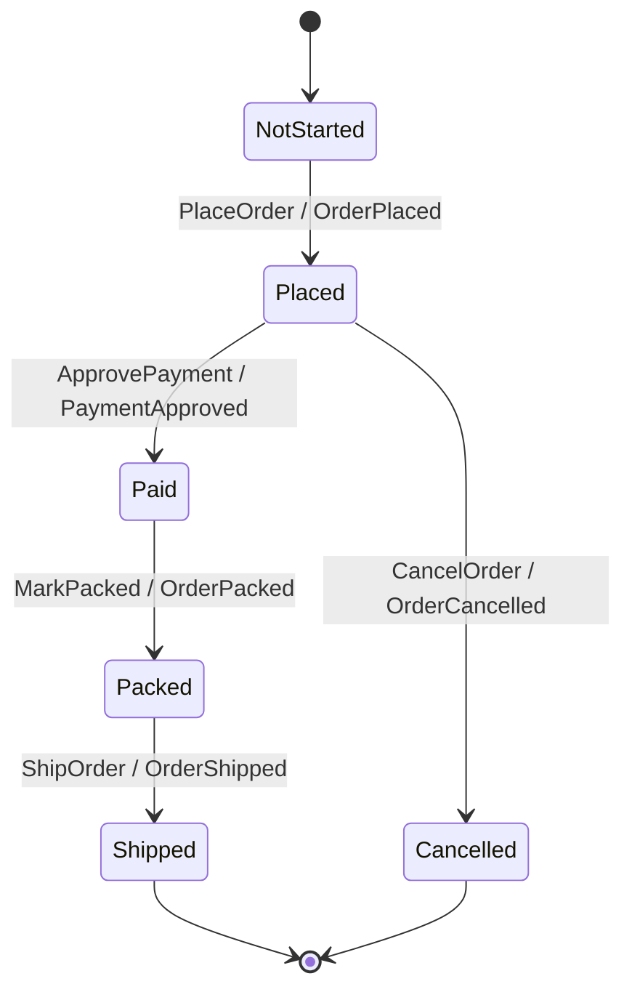

# Build The Command Side

The command side starts with a typed stream and an `EventStream`. A typed stream
is a `Stream a`, where the type parameter prevents accidental reuse of a stream
name with the wrong aggregate contract. In `jitsurei`, order streams are named
from the order id:

```haskell
orderStream :: OrderId -> Stream OrderEventStream
orderStream orderId = stream ("order-" <> orderIdText orderId)
```

The full implementation is in
[`../../jitsurei/src/Jitsurei/OrderStream.hs`](../../jitsurei/src/Jitsurei/OrderStream.hs).

`OrderEventStream` is a type alias for Keiro's event-stream contract. The
contract joins four pieces: the pure Keiki transducer, the initial state, the
event codec, and the stream-name function.

```haskell
type OrderEventStream =
  EventStream (HsPred OrderRegs OrderCommand) OrderRegs OrderState OrderCommand OrderEvent
```

The transducer is authored with Keiki's Template Haskell helpers and builder
DSL. The full module enables `TemplateHaskell`, `QualifiedDo`,
`BlockArguments`, and `OverloadedRecordDot`, then imports the two authoring
surfaces:

```haskell
import Keiki.Generics.TH (deriveAggregateCtors, deriveWireCtors)
import Keiki.Builder qualified as B
```

The domain types use one record payload per command and event constructor. That
shape is important: the TH helpers inspect constructors such as
`PlaceOrder PlaceOrderData` and `OrderPlaced OrderPlacedData`, then derive
field-aware helpers from the record names.

```haskell
data OrderCommand
  = PlaceOrder !PlaceOrderData
  | ApprovePayment !ApprovePaymentData

data PlaceOrderData = PlaceOrderData
  { orderId :: !OrderId
  , sku :: !Sku
  , quantity :: !Quantity
  }
```

Derive command-side helpers with `deriveAggregateCtors`. The first argument is
the command sum type, the second is the register-file type, and each pair maps a
real constructor name to the short suffix used in generated names:

```haskell
type OrderRegs = '[]

$( deriveAggregateCtors
    ''OrderCommand
    ''OrderRegs
    [ ("PlaceOrder", "PlaceOrder")
    , ("ApprovePayment", "ApprovePayment")
    , ("MarkPacked", "MarkPacked")
    , ("ShipOrder", "ShipOrder")
    , ("CancelOrder", "CancelOrder")
    ]
 )
```

For `PlaceOrder`, this gives the builder `inCtorPlaceOrder`, an input
constructor matcher. Inside `B.onCmd inCtorPlaceOrder`, the lambda argument is a
typed projection of `PlaceOrderData`, so `d.orderId`, `d.sku`, and `d.quantity`
can be used directly.

Derive event-side helpers with `deriveWireCtors`:

```haskell
$( deriveWireCtors
    ''OrderEvent
    [ ("OrderPlaced", "OrderPlaced")
    , ("PaymentApproved", "PaymentApproved")
    , ("OrderPacked", "OrderPacked")
    , ("OrderShipped", "OrderShipped")
    , ("OrderCancelled", "OrderCancelled")
    ]
 )
```

For `OrderPlaced`, this gives `wireOrderPlaced` and
`OrderPlacedTermFields`. The wire value names the event constructor to emit; the
term-fields record says how to fill that event from the current command
projection.

With the helpers generated, each transition is written in the builder DSL
instead of the lower-level `Edge` record syntax:

```haskell
B.from NotStarted do
  B.onCmd inCtorPlaceOrder $ \d -> B.do
    B.emit wireOrderPlaced OrderPlacedTermFields
      { orderId = d.orderId
      , sku = d.sku
      , quantity = d.quantity
      }
    B.goto Placed
```

That says `PlaceOrder` is accepted from `NotStarted`, emits `OrderPlaced`, and
lands in `Placed`. The builder has four moving parts:

- `B.buildTransducer NotStarted RNil isTerminal do` declares the initial state,
  the initial register file, and the terminal-state predicate.
- `B.from Placed do` groups all transitions whose source state is `Placed`.
- `B.onCmd inCtorApprovePayment $ \d -> B.do` adds a command-triggered edge and
  exposes the command payload as `d`.
- `B.emit wirePaymentApproved PaymentApprovedTermFields{...}` emits an event,
  and `B.goto Paid` declares the target state. Each `B.onCmd` body must call
  exactly one `B.goto`.

`ShipOrder` is only accepted from `Packed`; if a caller tries to ship an unpaid
order, there is no matching `B.onCmd` edge from the current state, so Keiro
returns `CommandRejected`.



That rejection behavior is tested in
[`../../jitsurei/test/Main.hs`](../../jitsurei/test/Main.hs) under
`Jitsurei command cycle`.

Applications run commands through `runCommand`:

```haskell
runCommand
  defaultRunCommandOptions
  orderEventStream
  (orderStream (OrderId "order-100"))
  ( PlaceOrder
      PlaceOrderData
        { orderId = OrderId "order-100"
        , sku = Sku "SKU-RED-MUG"
        , quantity = Quantity 3
        }
  )
```

At runtime Keiro loads the stream, decodes stored events, replays them through
the Keiki transducer, evaluates the new command, encodes the emitted events, and
appends them with optimistic concurrency. A successful append returns a
`CommandResult` with the final stream version, global position, and number of
events appended.

The example deliberately keeps command ids outside the command data. For normal
API requests, generate idempotency ids before calling `runCommand` and pass them
through `RunCommandOptions.eventIds`. For process-manager dispatch, Keiro
generates deterministic ids from the source event and manager metadata; see
[Process Managers And Timers](process-managers-and-timers.md).

The command-side acceptance check is:

```bash
cabal test jitsurei-test
```

The relevant examples place and pay for an order, read the stored stream back
from Kiroku, decode the recorded events with `orderCodec`, and assert that the
append order is `[OrderPlaced, PaymentApproved]`.
