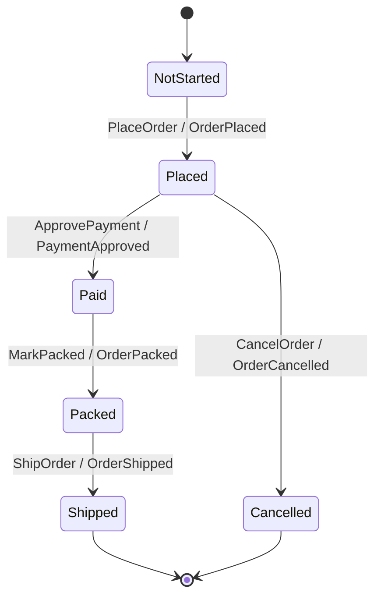

# Build The Command Side

The command side starts with a typed stream and an `EventStream`. A typed stream
is a `Stream a`, where the type parameter prevents accidental reuse of a stream
name with the wrong aggregate contract. In `jitsurei`, order streams are named
from the order id:

```haskell
orderStream :: OrderId -> Stream OrderEventStream
orderStream orderId = stream ("order-" <> orderIdText orderId)
```

The full implementation is in
[`../../jitsurei/src/Jitsurei/OrderStream.hs`](../../jitsurei/src/Jitsurei/OrderStream.hs).

`OrderEventStream` is a type alias for Keiro's event-stream contract. The
contract joins four pieces: the pure Keiki transducer, the initial state, the
event codec, and the stream-name function.

```haskell
type OrderEventStream =
  EventStream (HsPred OrderRegs OrderCommand) OrderRegs OrderState OrderCommand OrderEvent
```

The transducer is authored with the Keiki builder DSL, not the lower-level
`Edge` record syntax. Template Haskell derives command constructor projections
and event wire constructors from the record payload types, then the builder
reads like the state transition it represents:

```haskell
B.from NotStarted do
  B.onCmd inCtorPlaceOrder $ \d -> B.do
    B.emit wireOrderPlaced OrderPlacedTermFields
      { orderId = d.orderId
      , sku = d.sku
      , quantity = d.quantity
      }
    B.goto Placed
```

That says `PlaceOrder` is accepted from `NotStarted`, emits `OrderPlaced`, and
lands in `Placed`. `ShipOrder` is only accepted from `Packed`; if a caller tries
to ship an unpaid order, there is no matching edge, so Keiro returns
`CommandRejected`.



That rejection behavior is tested in
[`../../jitsurei/test/Main.hs`](../../jitsurei/test/Main.hs) under
`Jitsurei command cycle`.

Applications run commands through `runCommand`:

```haskell
runCommand
  defaultRunCommandOptions
  orderEventStream
  (orderStream (OrderId "order-100"))
  ( PlaceOrder
      PlaceOrderData
        { orderId = OrderId "order-100"
        , sku = Sku "SKU-RED-MUG"
        , quantity = Quantity 3
        }
  )
```

At runtime Keiro loads the stream, decodes stored events, replays them through
the Keiki transducer, evaluates the new command, encodes the emitted events, and
appends them with optimistic concurrency. A successful append returns a
`CommandResult` with the final stream version, global position, and number of
events appended.

The example deliberately keeps command ids outside the command data. For normal
API requests, generate idempotency ids before calling `runCommand` and pass them
through `RunCommandOptions.eventIds`. For process-manager dispatch, Keiro
generates deterministic ids from the source event and manager metadata; see
[Process Managers And Timers](process-managers-and-timers.md).

The command-side acceptance check is:

```bash
cabal test jitsurei-test
```

The relevant examples place and pay for an order, read the stored stream back
from Kiroku, decode the recorded events with `orderCodec`, and assert that the
append order is `[OrderPlaced, PaymentApproved]`.
