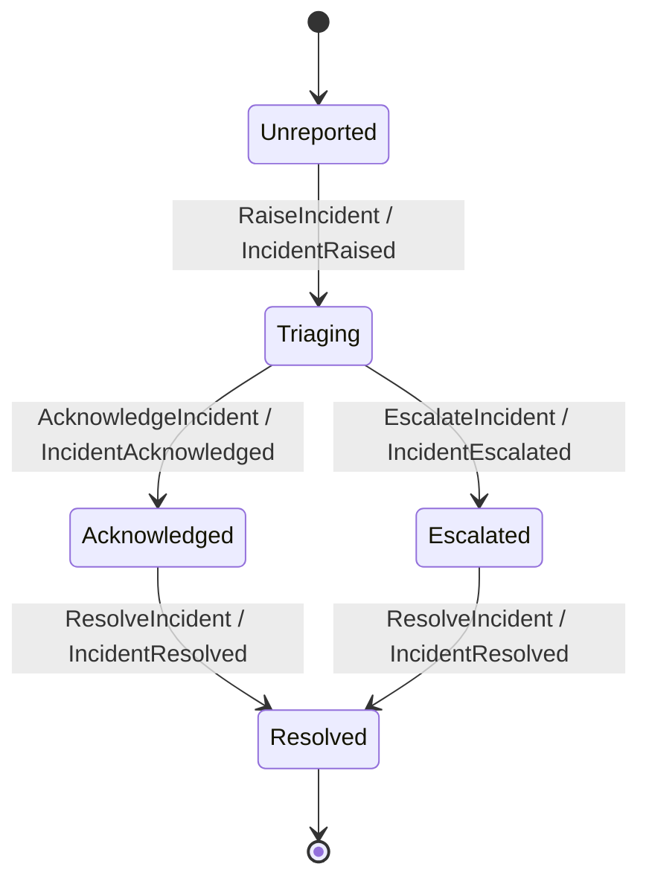
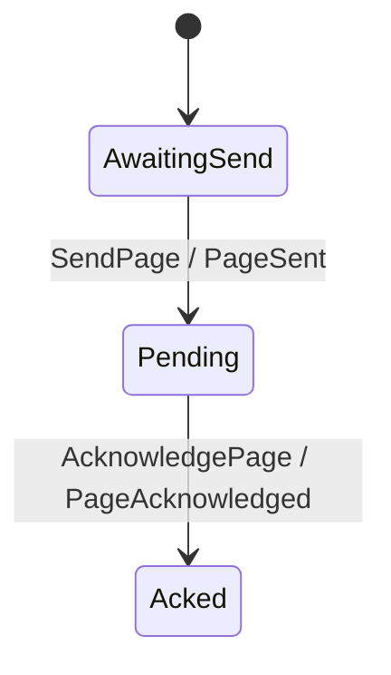
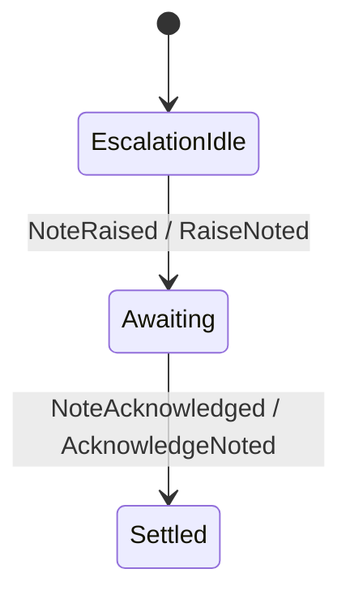

# Coordinating Incident Response: Routers And Process Managers Together

Keiro has two fan-out primitives, and they are named after the two Enterprise
Integration Patterns (Hohpe & Woolf, *Enterprise Integration Patterns*) they
implement:

- A **`Router`** is the *Message Router* family — specifically a *content-based
  Router* and, when it forwards to a computed set of destinations, a dynamic
  *Recipient List*. It is **stateless**: it examines one message, computes its
  recipients, and forwards. Keiro's `Router` adds one thing the book assumes you
  have on tap — the recipient set is computed *effectfully*, by querying a read
  model — so it can route by data that lives outside the message.

- A **`ProcessManager`** is the *Process Manager*: a **stateful** central
  coordinator that maintains the state of a multi-step process, decides the next
  step from intermediate results, and owns timers. It has its own state stream
  and a correlation id that ties messages to a running instance.

The earlier guides show each alone — [Routers And Effectful
Fan-Out](routers-and-effectful-fan-out.md) and [Process Managers And
Timers](process-managers-and-timers.md). This guide shows them **together**,
because real workflows usually need both, and the interesting question is *which
job goes to which*.

## When to reach for which

> **Use a `Router` when** the reaction is "forward this to a set of recipients I
> have to look up," there is **no per-recipient state** to remember, and each
> dispatch is independently idempotent.
>
> **Use a `ProcessManager` when** the reaction needs **memory across events or
> time**: a correlated instance that moves through states, waits for a later
> event, or arms a timer.

A handy tell: if you catch yourself wanting to remember "what happened last" or
"how long ago," that is a process manager. If you only need "who should hear
about this, right now," that is a router.

## The domain

On-call incident response. When an incident is raised against a service, two
things must happen, and they are different in kind:

1. **Page the on-call responders.** Who is on call depends on the *roster*, not
   on the incident — so the recipient set must be looked up. There is no
   per-page state to coordinate. → a **router**.
2. **Run the acknowledgement clock.** The incident must be acknowledged within a
   severity-dependent window, or it escalates. That is a correlated, time-bound,
   multi-step process. → a **process manager**.

Both react to the *same* `IncidentRaised` event. The source lives in:

- [`../../jitsurei/src/Jitsurei/Incident.hs`](../../jitsurei/src/Jitsurei/Incident.hs) — the incident aggregate.
- [`../../jitsurei/src/Jitsurei/Paging.hs`](../../jitsurei/src/Jitsurei/Paging.hs) — the page aggregate and the router.
- [`../../jitsurei/src/Jitsurei/OncallRoster.hs`](../../jitsurei/src/Jitsurei/OncallRoster.hs) — the on-call read model.
- [`../../jitsurei/src/Jitsurei/EscalationProcess.hs`](../../jitsurei/src/Jitsurei/EscalationProcess.hs) — the process manager and the escalation timer.

The two keiro primitives are `Keiro.Router`
([`../../src/Keiro/Router.hs`](../../src/Keiro/Router.hs)) and
`Keiro.ProcessManager`
([`../../src/Keiro/ProcessManager.hs`](../../src/Keiro/ProcessManager.hs)).

## The aggregates

The **incident** is the source of truth. Note the deliberately tight guards:
`AcknowledgeIncident` and `EscalateIncident` are each legal only from
`Triaging`, so whichever arrives first wins and the other becomes a harmless
`CommandRejected`. That guard is what makes the escalation timer safe to fire
even after an acknowledgement (more below).

<!-- jitsurei-diagram: incident-stream begin -->

<!-- jitsurei-diagram: incident-stream end -->

A **page** is the per-responder artifact the router creates — sent, then
acknowledged:

<!-- jitsurei-diagram: page-stream begin -->

<!-- jitsurei-diagram: page-stream end -->

Both are ordinary keiro `EventStream` definitions built with the keiki Builder
DSL and validated before they reach routers, process managers, or command
runners, exactly as in [Build The Command Side](build-the-command-side.md).

## The read model the router queries

`serviceOncallReadModel` maps a service to the responders on call for it. It is a
plain read model (see [Project Read Models](project-read-models.md)); the only
thing special about it here is *who reads it* — the router, at routing time:

```haskell
serviceOncallReadModel :: ReadModel Service [Responder]
```

## Reaction 1 — the router pages the roster

`pagingRouter` resolves the recipients effectfully and dispatches one `SendPage`
per responder. It keeps no state; re-running it on the same `IncidentRaised`
re-pages nobody (deterministic command ids):

```haskell
pagingRouter = Router
  { name = "jitsurei-paging"
  , key = \raised -> incidentIdText raised.incidentId
  , resolve = \raised -> do
      result <- runQuery serviceOncallReadModel raised.service     -- the effectful seam
      let responders = either (const []) id result
      pure
        [ PMCommand
            { target = pageCommandStream raised.incidentId responder.responderId
            , command = SendPage (SendPageData { incidentId = raised.incidentId, responderId = responder.responderId })
            }
        | responder <- responders
        ]
  , targetEventStream = pageEventStream
  , targetProjections = []
  }
```

This is the recipient list: examine the message, look up the recipients, forward
to each. `targetProjections = []` keeps this router append-only; use a non-empty
list when the page aggregate has inline read models that must be updated in the
same transaction as a router-dispatched command. No memory, no timers — so it is
a router, not a process manager.

## Reaction 2 — the process manager runs the clock

`escalationProcessManager` correlates on the incident id and keeps a small saga
state stream (`esc-<incident>`):

<!-- jitsurei-diagram: escalation-stream begin -->

<!-- jitsurei-diagram: escalation-stream end -->

It reacts to two signals:

```haskell
handle = \case
  IncidentReported raised ->          -- from the incident's IncidentRaised
    ProcessManagerAction
      { command = NoteRaised (NoteRaisedData { incidentId = raised.incidentId })   -- advance the saga
      , commands = []
      , timers = [escalationTimerRequest raised.incidentId (escalationDeadline raised.raisedAt raised.severity)]
      }
  ResponderAcked acked ->             -- from a page's PageAcknowledged
    ProcessManagerAction
      { command = NoteAcknowledged (NoteAcknowledgedData { incidentId = acked.incidentId })
      , commands =
          [ PMCommand                  -- drive the incident itself
              { target = incidentCommandStream acked.incidentId
              , command = AcknowledgeIncident (AcknowledgeIncidentData { incidentId = acked.incidentId })
              }
          ]
      , timers = []
      }
```

The full `ProcessManager` record also has `targetEventStream` and
`targetProjections`. The projections belong to the target aggregate, not to the
process manager's private saga stream. Existing process managers that do not
need read-model writes on target dispatch should set `targetProjections = []`;
non-empty lists run in the same transaction as each dispatched target command.
Use a non-empty list when the next process-manager decision, guard, or immediate
user read needs read-your-own-writes for the target aggregate. Keep the list
empty when dispatch is only advancing another aggregate and async projection
freshness is enough. Because these projection writes share the command append
transaction, keep them small, deterministic, and local to the target read model.

On `IncidentReported` it advances its state and **arms an escalation timer**
whose deadline comes from the severity (`escalationDeadline`). On
`ResponderAcked` it advances its state and **dispatches `AcknowledgeIncident`**
to the incident aggregate. The memory (where is this incident in its lifecycle?)
and the timer are exactly what a router cannot provide.

## The two reactions are not symmetric

Notice what each writes to. The **router** writes to *page* streams — fresh
per-responder artifacts. The **process manager** keeps its *own* saga stream and
writes commands back to the *incident*. The router fans out widely and forgets;
the process manager remembers one incident and shepherds it.

## Escalation, and a race resolved by the aggregate

If nobody acknowledges in time, a timer worker fires the escalation:

```haskell
runEscalationTimerWorker options now =
  runTimerWorker now $ \timer -> do
    -- ... derive the incident id from the due timer ...
    _ <- runCommand options incidentEventStream (incidentStream incidentId)
           (EscalateIncident (EscalateIncidentData { incidentId = incidentId }))
    pure (Just firedEventId)
```

`incidentEventStream` is the validated stream value. The raw
`incidentEventStreamDef` remains available only for construction and validation;
the command runner will not accept it directly.

What about the ack-vs-escalate race? The worker does **not** check whether the
incident was already acknowledged. It does not need to: the incident aggregate
allows `EscalateIncident` only from `Triaging`, so if an acknowledgement already
moved it to `Acknowledged`, the escalate command is a benign `CommandRejected`
and nothing is written. The *target aggregate's guards* resolve the race, which
keeps both the timer worker and the process manager simple. This is a keiro
idiom worth internalizing: push race resolution down to the aggregate that owns
the invariant.

## The whole flow

```text
RaiseIncident ─▶ IncidentRaised (incident-42)
                   │
   ┌───────────────┴───────────────────────────┐
   ▼                                            ▼
pagingRouter (stateless)                escalationProcessManager (stateful)
   look up on-call for the service         NoteRaised → esc-42 = Awaiting
   SendPage → page-42-alice, …             arm escalation timer (raisedAt + SLA)
                                            │
   responder acks ─▶ PageAcknowledged       │
        │                                   │
        └────────────▶ ResponderAcked ──────┤
                          NoteAcknowledged → esc-42 = Settled
                          AcknowledgeIncident → incident-42 = Acknowledged
                                            │
   (no ack before deadline)                 ▼
        escalation timer fires ─▶ EscalateIncident → incident-42 = Escalated
        (a no-op if already Acknowledged — the aggregate's guard)
```

## Verifying it

The specs are in
[`../../jitsurei/test/Main.hs`](../../jitsurei/test/Main.hs) under "Jitsurei
incident aggregate", "Jitsurei paging", and "Jitsurei escalation process
manager". They show: the router pages exactly the rostered responders (and
re-pages nothing on replay); the process manager schedules the escalation timer
on raise and dispatches `AcknowledgeIncident` on an ack (idempotently); and the
escalation timer escalates an unacknowledged incident but is a benign no-op once
it has been acknowledged.

```bash
cabal test jitsurei-test
```

The state diagrams above are generated from the transducers; after changing one,
regenerate and verify:

```bash
cabal run jitsurei:exe:jitsurei-diagrams -- --write
cabal run jitsurei:exe:jitsurei-diagrams -- --check
```
