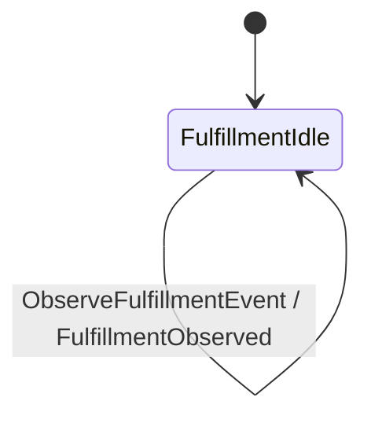

# Process Managers And Timers

A process manager reacts to one stream and emits commands to another stream.
`jitsurei` uses this to model fulfillment: when an order receives
`PaymentApproved`, the fulfillment manager records that it observed the payment
and emits `MarkPacked` to the order stream.

The manager lives in
[`../../jitsurei/src/Jitsurei/FulfillmentProcess.hs`](../../jitsurei/src/Jitsurei/FulfillmentProcess.hs).
It has its own stream family, `fulfillment-<order-id>`, and its own small event
stream:

```haskell
data FulfillmentCommand = ObserveFulfillmentEvent ObserveFulfillmentEventData
data FulfillmentEvent = FulfillmentObserved FulfillmentObservedData
```

The fulfillment stream diagram is generated from `fulfillmentTransducer`
through `Keiki.Render.Mermaid.toMermaid`. Do not hand-edit it; after changing
the transducer, run:

```bash
cabal run jitsurei:exe:jitsurei-diagrams -- --write
cabal run jitsurei:exe:jitsurei-diagrams -- --check
```

<!-- jitsurei-diagram: fulfillment-stream begin -->

<!-- jitsurei-diagram: fulfillment-stream end -->

The process manager's `handle` function is pure. It always advances the manager
state stream with an observation event. For `PaymentApproved`, it also returns a
target command:

```haskell
PMCommand
  { target = orderCommandStream orderId
  , command = MarkPacked (MarkPackedData orderId)
  }
```

`runProcessManagerOnce` receives the recorded source event and the decoded
domain event. Keiro derives deterministic event ids from manager name,
correlation id, source event id, and command index. If the same source event is
delivered again, the manager reports duplicate results rather than appending a
second manager event or packing command.

The test in
[`../../jitsurei/test/Main.hs`](../../jitsurei/test/Main.hs) first places and
pays an order, reads the recorded `PaymentApproved` event from Kiroku, runs the
manager, then runs it a second time and asserts `PMStateDuplicate` plus
`PMCommandDuplicate`.

Timers are database-backed scheduled actions. The timer example lives in
[`../../jitsurei/src/Jitsurei/Timers.hs`](../../jitsurei/src/Jitsurei/Timers.hs).
It builds a payment-timeout `TimerRequest` and a worker that marks a claimed
timer fired.

The example uses `Data.TypeID.V7` from `mmzk-typeid` to derive UUID values for
timer and event fixtures. Do not use the `uuid` package as if it generated
UUIDv7 values; it does not provide that capability here.

Local tests schedule the timer with `scheduleTimerTx`, call
`runPaymentTimeoutWorker`, and assert that a due row was claimed. Production
workers usually loop around `runTimerWorker`, append or submit a command from
the timer payload, and return the event id that represents successful firing.

## Snapshotting A Long-Running Manager

`fulfillmentEventStream` uses `snapshotPolicy = Never` because the fulfillment
manager's state stream stays tiny. A manager that reacts many times over a long
life should instead give its raw event-stream definition a snapshot policy and
state codec before validating it, exactly as
[`OrderStream.hs`](../../jitsurei/src/Jitsurei/OrderStream.hs) does for
`snapshotOrderEventStreamDef` / `snapshotOrderEventStream`. Because
`runProcessManagerOnce` advances manager state through the same command path as
`runCommand`, snapshots of the manager state stream need no extra code — only
the `snapshotPolicy` and `stateCodec` fields plus the usual validation step. The
keiro test suite's `describe "Keiro.ProcessManager snapshots"` block proves a
`pm:` state stream snapshots at its threshold and that a later reaction replays
only the tail. See [Snapshots And Hydration](snapshots-and-hydration.md) for the
codec and shape-hash rules.
