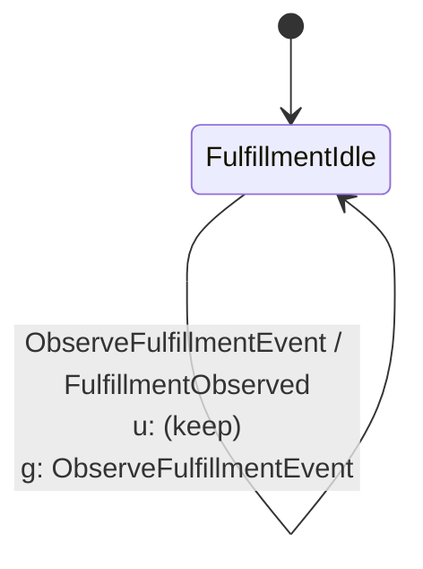

# Process Managers And Timers

A process manager reacts to one stream and emits commands to another stream.
`jitsurei` uses this to model fulfillment: when an order receives
`PaymentApproved`, the fulfillment manager records that it observed the payment
and emits `MarkPacked` to the order stream.

The manager lives in
[`../../jitsurei/src/Jitsurei/FulfillmentProcess.hs`](../../jitsurei/src/Jitsurei/FulfillmentProcess.hs).
It has its own stream family, `fulfillment-<order-id>`, and its own small event
stream:

```haskell
data FulfillmentCommand = ObserveFulfillmentEvent ObserveFulfillmentEventData
data FulfillmentEvent = FulfillmentObserved FulfillmentObservedData
```

The fulfillment stream diagram is generated from `fulfillmentTransducer`
through `Keiki.Render.Mermaid.toMermaid`. Do not hand-edit it; after changing
the transducer, run:

```bash
cabal run jitsurei:exe:jitsurei-diagrams -- --write
cabal run jitsurei:exe:jitsurei-diagrams -- --check
```

<!-- jitsurei-diagram: fulfillment-stream begin -->

```mermaid
stateDiagram-v2
    [*] --> FulfillmentIdle
    FulfillmentIdle --> FulfillmentIdle : ObserveFulfillmentEvent / FulfillmentObserved<br/>u: (keep)<br/>g: ObserveFulfillmentEvent
```
<!-- jitsurei-diagram: fulfillment-stream end -->

The process manager's `handle` function is pure. It always advances the manager
state stream with an observation event. For `PaymentApproved`, it also returns a
target command:

```haskell
PMCommand
  { target = orderCommandStream orderId
  , command = MarkPacked (MarkPackedData orderId)
  }
```

`runProcessManagerOnce` receives the recorded source event and the decoded
domain event. Keiro derives deterministic event ids from manager name,
correlation id, source event id, and command index. If the same source event is
delivered again, the manager reports duplicate results rather than appending a
second manager event or packing command.

The test in
[`../../jitsurei/test/Main.hs`](../../jitsurei/test/Main.hs) first places and
pays an order, reads the recorded `PaymentApproved` event from Kiroku, runs the
manager, then runs it a second time and asserts `PMStateDuplicate` plus
`PMCommandDuplicate`.

Timers are database-backed scheduled actions. The timer example lives in
[`../../jitsurei/src/Jitsurei/Timers.hs`](../../jitsurei/src/Jitsurei/Timers.hs).
It builds a payment-timeout `TimerRequest` and a worker that marks a claimed
timer fired.

The example uses `Data.TypeID.V7` from `mmzk-typeid` to derive UUID values for
timer and event fixtures. Do not use the `uuid` package as if it generated
UUIDv7 values; it does not provide that capability here.

Local tests schedule the timer with `scheduleTimerTx`, call
`runPaymentTimeoutWorker`, and assert that a due row was claimed. Production
workers usually loop around `runTimerWorker`, append or submit a command from
the timer payload, and return the event id that represents successful firing.

## Reactions With Optional Saga Advancement

Import `Keiro.ProcessManager.Reaction` when one input may deliberately avoid a
saga command, when follow-ups depend on a typed domain outcome, or when the
reaction needs transactional schedule/cancel operations. The API is additive;
existing `ProcessManager` values and runners keep their behavior.

A reaction is a pure value selected from the decoded input:

```haskell
reactToIncident :: IncidentInput -> ReactionPlan SagaCommand IncidentCommand
reactToIncident = \case
  Reported incidentId severity raisedAt ->
    AdvanceReaction
      { command = NoteReported incidentId
      , followUps =
          [ FollowSchedule Rearm (routineTimer incidentId raisedAt)
          , FollowSchedule Once (urgentTimer incidentId severity raisedAt)
          ]
      , onAccepted = []
      }
  Acknowledged incidentId ->
    AdvanceReaction
      { command = NoteAcknowledged incidentId
      , followUps = []
      , onAccepted =
          [ FollowDispatch
              PMCommand
                { target = incidentCommandStream incidentId
                , command = AcknowledgeIncident incidentId
                }
          , FollowCancel (routineTimerId incidentId)
          , FollowCancel (urgentTimerId incidentId)
          ]
      }
  RecheckOnly _ -> NoAdvance []
```

Wire that function into a `ReactiveProcessManager` with a domain command
handler for the saga and a validated target event stream:

```haskell
incidentManager =
  ReactiveProcessManager
    { name = "incident-reaction"
    , correlate = incidentCorrelationId
    , sagaHandler = incidentSagaHandler
    , streamFor = incidentSagaStream
    , targetEventStream = incidentEventStream
    , targetProjections = const []
    , react = reactToIncident
    }

runOne recorded input =
  runReactiveProcessManagerOnce commandOptions incidentManager recorded input

runWorker adapter =
  runReactiveProcessManagerWorkerWith
    workerOptions
    commandOptions
    incidentManager
    adapter
    decodeIncidentMessage
```

The complete compile-checked example used by the runtime tests is
[`../../keiro/test/ReactionExample.hs`](../../keiro/test/ReactionExample.hs). It
uses reported and acknowledged inputs, injected timestamps, routine and urgent
timer identities, accepted-only dispatch/cancellation, and a no-advance path.
Its timer callback runs through the ordinary `runTimerWorker`; a target-state
guard makes a late callback benign if the worker claimed the timer before the
cancellation committed.

### Read The Result Literally

`ReactionNotAdvanced` means no saga command was attempted.
`ReactionEvaluated outcome` preserves the typed accepted, rejected, no-op, or
eventless result observed by this invocation. `ReactionDuplicate eventId`
means the exact first-event acceptance witness was recovered from the intended
saga stream. A duplicate cannot reconstruct the original emitted event batch;
it proves acceptance only. `ReactionCommandFailed` is a command failure, while
`ReactionWitnessMissing` and `ReactionWitnessUndecodable` are recovery-integrity
failures that the worker halts with bounded reason codes.

`ReactionTimerEffects` reports the timer transaction that actually committed.
`statementsCommitted` includes guarded no-op statements, `onceInserted` counts
new insert-only timers, and `timersCancelled` counts changed rows. A replay that
recovers accepted state reports no timer statements because it skips that phase.

### Respect The Transaction Boundary

For an advancing reaction, the saga's accepted events and the selected timer
operations commit in one transaction. Target commands then run one at a time in
their own transactions. A target failure cannot undo saga state or timers, and
a later target may commit even when an earlier target failed. Redelivery
deduplicates eventful successes and retries missing targets, so attempt order is
declared order but durable commit order may differ after failure or concurrency.
Use a different coordination policy if commands require a global commit order.

`deterministicReactionCommandId` keys each target write by the manager name,
correlation id, source event id, physical target stream, and occurrence among
commands to that target. Keep the reaction's input-derived target list, order,
commands, and payloads stable for a source event. The ID records an eventful
target success; a target rejection, no-op, or eventless acceptance has no target
receipt and may be evaluated again.

### Put Acceptance-Exclusive Effects Under `onAccepted`

`NoAdvance` and a saga rejection, no-op, or eventless acceptance leave no saga
receipt. Their unconditional timer effects can run again on redelivery. A
concurrent delivery can also accept after a silent invocation's final witness
probe but before its unconditional timer transaction. This is deliberate and
observable; the runtime does not claim exactly-once evaluation. Put timers and
dispatches that must occur only with durable acceptance in `onAccepted`.

`Once` inserts only when no row with that timer id exists. It preserves an
existing deadline and payload and never revives a fired, cancelled, dead,
firing, or foreground-owned row. `Rearm` replaces deadline and payload only
while the row remains scheduled. `FollowCancel` shares the saga append
transaction, but an absent cancellation creates no tombstone and cancellation
cannot revoke work already claimed by a timer callback. The target command must
therefore tolerate a late firing.

### Cut Over As An Identity Migration

Changing an existing manager from the legacy runner to the reaction runner does
not translate old positional target ids. Pause and drain source deliveries,
partial fan-out, pending timers, and every allowed historical replay before the
new runner becomes authoritative. Otherwise the retained saga witness can prove
old acceptance while the new target-keyed id appends the target action again.
The same drain review applies when reordering or changing same-target commands
inside the reaction family. A version label does not change the id seed, and
there is no automatic dual-identity fallback. See
[Deploy Ordering](../user/deploy-ordering.md#4-drain-process-manager-and-router-decide-changes).

## Snapshotting A Long-Running Manager

`fulfillmentEventStream` uses `snapshotPolicy = Never` because the fulfillment
manager's state stream stays tiny. A manager that reacts many times over a long
life should instead give its raw event-stream definition a snapshot policy and
state codec before validating it, exactly as
[`OrderStream.hs`](../../jitsurei/src/Jitsurei/OrderStream.hs) does for
`snapshotOrderEventStreamDef` / `snapshotOrderEventStream`. Because
`runProcessManagerOnce` advances manager state through the same command path as
`runCommand`, snapshots of the manager state stream need no extra code — only
the `snapshotPolicy` and `stateCodec` fields plus the usual validation step. The
keiro test suite's `describe "Keiro.ProcessManager snapshots"` block proves a
`pm:` state stream snapshots at its threshold and that a later reaction replays
only the tail. See [Snapshots And Hydration](snapshots-and-hydration.md) for the
codec and shape-hash rules.
