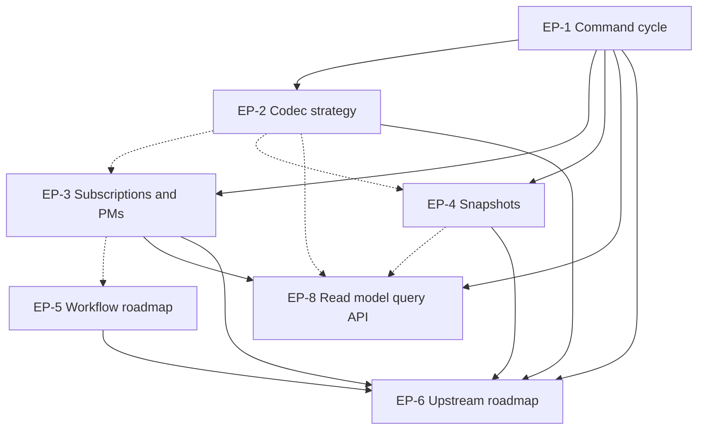

# keiro Research Foundation

This MasterPlan is a living document. The sections Progress, Surprises & Discoveries, Decision Log, and Outcomes & Retrospective must be kept up to date as work proceeds.

## Vision & Scope

経路 ("keiro") is a Haskell library that turns the existing components — kiroku (Postgres event store), keiki (pure decider/evolve core), shibuya (subscription engine), shibuya-pgmq-adapter, shibuya-kiroku-adapter, pgmq-hs — into a single, production-quality event-sourcing and workflow engine. The framework will replace an in-production system, so correctness, observability, and operational simplicity are non-negotiable. The framework is library-shaped: applications import keiro and connect to a Postgres database; there is no separate server to operate.

The runtime substrate is already opinionated and *shared across these components*: Postgres for storage, `hasql` for SQL, `effectful` for the effect system, and **`streamly` (composewell) for every stream of messages or events the framework moves**. Shibuya's adapter abstraction is `Stream (Eff es) (Ingested es msg)` and its runners are built on `Stream.fold Fold.drain`-shaped pipelines; kiroku-store's subscription bridge (`Kiroku.Store.Subscription.Stream`) returns a `Streamly.Data.Stream.Stream`. keiro's own abstractions — hydration pipelines, projection runners, process-manager loops, outbox relays, snapshot-accelerated replay — are expected to be expressed with the same `Stream` and `Fold` types and the broader Streamly primitive set (e.g. `Stream.unfoldrM`, `Stream.morphInner`, `Fold.foldlM'`, `Stream.foldMany`). This is not a future bet; it is the shape the dependencies already impose.

The single user-visible behavior keiro must enable is the canonical command-handling cycle: a caller submits a command targeting an aggregate, the framework loads that aggregate's events from kiroku, folds them into state via keiki, runs the decider, and appends new events back to kiroku with optimistic concurrency. The same primitive supports projections (synchronous or asynchronous), process managers (event-sourced workflow coordinators), and — in a later phase — durable execution of long-running workflows.

This MasterPlan is **not** the implementation plan. Its purpose is to take keiro from "scaffold" to "ready to implement". After the surveys in `docs/research/01-...` through `docs/research/05-...` (which describe the current state of the dependencies and the prior art), each child ExecPlan in this MasterPlan produces a concrete *design document* — and where appropriate a small Haskell *spike* — that resolves a specific design question. Together they yield a complete, internally consistent design for keiro v1.

In scope: the design and validation of (1) the load → fold → decide → append cycle including its transactional semantics and retry behaviour, (2) the codec / event-schema layer, (3) projections, subscriptions, and process managers (including the transactional outbox), (4) snapshots, (5) the workflow / durable-execution roadmap, and (6) the consolidated set of upstream feature gaps that kiroku and keiki must close in parallel.

Out of scope: writing the production keiro library itself; that is a separate MasterPlan to be authored after this one is complete. Stretch features identified for v2 (full deterministic-replay durable execution, awakeables, child workflows, multi-region, schema registry, LISTEN/NOTIFY-based push delivery, consumer-group sharding, field-level encryption) are documented in the workflow roadmap but are deliberately deferred.

## Decomposition Strategy

The decomposition is by functional concern, with one ExecPlan per top-level keiro capability. The choice of six plans follows the principle in `MASTERPLAN.md` (two-to-seven plans per MasterPlan; introduce phases when more are needed). Each plan owns a coherent design surface, can be reviewed independently by a domain expert, and produces an artifact (a `docs/research/NN-*.md` design document, sometimes accompanied by a Haskell spike under a clearly labelled directory) that is independently verifiable.

The user explicitly identified the load → fold → decide → append cycle as the most important research surface. That cycle is therefore plan 1 and is the only plan with a substantive *implementation* spike — every other plan validates its design with prose and (where necessary) a tiny throwaway prototype rather than production-shaped code. Plan 1 is also the foundation that the other plans assume: codecs (plan 2), subscriptions and process managers (plan 3), and snapshots (plan 4) all extend or accelerate the same cycle, and the workflow roadmap (plan 5) builds on top of process managers introduced in plan 3.

Alternatives considered:

- **One mega-plan covering the entire framework design.** Rejected: it would breach the "fewer than seven" guidance only by replacing six well-bounded plans with one unwieldy plan. Independent reviewability would be lost.
- **Splitting the command cycle into separate "hydration" and "command bus" plans.** Rejected: hydration without an append target is meaningless, and the optimistic-retry loop straddles both halves. Splitting would create artificial integration points where there are none.
- **A separate plan per upstream gap (kiroku-side, keiki-side).** Rejected: gaps can only be enumerated correctly *after* the keiro-facing design is settled, so they collapse naturally into a single synthesis plan (plan 6).
- **A plan dedicated to the transactional outbox.** Rejected: the outbox is one feature inside the projections / process-managers concern (plan 3) and does not warrant its own plan.

The result is one foundation plan, four parallel research plans, and one synthesis plan, in a phased shape:

- **Phase A — Foundation.** Plan 1 (command cycle) must complete first, because every other plan refers to its types and combinators.
- **Phase B — Parallel research.** Plans 2, 3, 4, and 5 can run concurrently after Phase A. Each is self-contained relative to the others: plan 2 does not need plan 3's snapshots, and so on.
- **Phase C — Synthesis.** Plan 6 (upstream roadmap) reads the outputs of plans 1–5 and produces a single consolidated list of upstream feature work to land in kiroku and keiki.

## Exec-Plan Registry

| # | Title | Path | Hard Deps | Soft Deps | Status |
|---|-------|------|-----------|-----------|--------|
| 1 | Command Cycle Design and Spike | docs/plans/1-command-cycle-design-and-spike.md | None | None | Complete |
| 2 | Codec and Event Schema Strategy | docs/plans/2-codec-and-event-schema-strategy.md | EP-1 | None | Complete |
| 3 | Subscriptions, Projections and Process Managers | docs/plans/3-subscriptions-projections-and-process-managers.md | EP-1 | EP-2 | Complete |
| 4 | Snapshot Strategy and Hydration Acceleration | docs/plans/4-snapshot-strategy-and-hydration-acceleration.md | EP-1 | EP-2 | Complete |
| 5 | Workflow Engine and Durable Execution Roadmap | docs/plans/5-workflow-engine-and-durable-execution-roadmap.md | None | EP-3 | Complete |
| 6 | Upstream Roadmap for Kiroku and Keiki | docs/plans/6-upstream-roadmap-for-kiroku-and-keiki.md | EP-1, EP-2, EP-3, EP-4, EP-5 | None | Complete |
| 8 | Read Model Query API and Lifecycle Design | docs/plans/8-read-model-query-api-and-lifecycle-design.md | EP-1, EP-3 | EP-2, EP-4 | Complete |

Status values: Not Started, In Progress, Complete, Cancelled. Hard Deps and Soft Deps reference other rows by their `EP-N` prefix.

EP-7 (`docs/plans/7-internal-decider-style-ergonomic-facade-over-runcommand.md`) is intentionally absent from the registry: it is an ergonomic-hedge ExecPlan cascaded out of the 2026-05-09 SymTransducer cost-benefit audit (see Surprises & Discoveries entry of 2026-05-09) and is not part of the research-foundation surface. It is out of scope for this MasterPlan and is tracked separately. EP-8's number continues from EP-7's existing on-disk number to keep `docs/plans/` numbering monotonic, even though EP-8 is the seventh registered child plan.

## Dependency Graph

The plan order is foundation → parallel research → synthesis.

Solid edges are hard dependencies, dashed edges soft. EP-7 is deliberately absent
for the reason given under the registry above. The prose below states each edge.

EP-1 (command cycle) is the foundation. It defines the types and combinators every other plan refers to: `EventStream phi rs s ci co`, `Stream a`, `runCommand`, the optimistic-retry loop, and the transactional-step primitive. Until those types are written down, EP-2 cannot pick a codec signature, EP-3 cannot describe how a process manager runs a mini command cycle, and EP-4 cannot describe how a snapshot accelerates the hydration phase. EP-1 therefore has no dependencies and must complete first.

EP-2 (codecs) hard-depends on EP-1 because the codec layer must produce the exact types the command cycle expects (typed events going into `EventData.payload`, decoded back into the keiki domain type). EP-2 can be drafted in parallel with EP-1 once the latter has fixed its public types in the design document, but a clean validation of EP-2 requires EP-1's spike.

EP-3 (subscriptions, projections, process managers) hard-depends on EP-1 because a subscription handler that reacts to events and emits commands runs a *miniature* command cycle internally, including optimistic retry. It soft-depends on EP-2 because subscription handlers prefer typed events over raw `Value` payloads. If EP-2 slips, EP-3 can use untyped payloads in its prototype with a clearly labelled "TODO swap to typed".

EP-4 (snapshots) hard-depends on EP-1 because the snapshot path is an optimization of EP-1's hydration phase, and the snapshot decoder must agree with the codec layer (soft dep on EP-2). It does not block any other plan; it can be deferred safely.

EP-5 (workflow roadmap) does not hard-depend on any other plan: it is mostly literature work derived from `docs/research/05-workflow-prior-art.md`. It soft-depends on EP-3 because process managers are the v1 stand-in for a "real" workflow engine, and the roadmap must align with what EP-3 actually delivers. EP-5 can run early and in parallel with the others.

EP-6 (upstream roadmap) hard-depends on every other plan because it consolidates the feature gaps each plan identifies in kiroku and keiki. It is the final synthesis step.

Plans that can proceed in parallel: EP-2, EP-3, EP-4, and EP-5 once EP-1 is complete.

EP-8 (read-model query API and lifecycle, added 2026-05-10) hard-depends on EP-1 (its position-wait helper consumes the `globalPosition` returned by EP-1's `runCommand` result) and EP-3 (read models are the *queried* artefact whose write-side mechanics — projection lifecycles, at-least-once semantics, idempotency requirement — EP-3 owns; EP-8 must agree with EP-3 §3 and §4 verbatim). It soft-depends on EP-2 (read-model rows decode events through the value-level `Codec e` defined in EP-2; if a read model wants typed event payloads it consumes EP-2's record, but EP-8's spike can fall back to raw `Aeson.Value` payloads if needed) and EP-4 (EP-8's §6 rebuild protocol borrows EP-4's `regfile_shape_hash`-style schema-evolution detection pattern, but read-model rebuild is *not* fall-through-on-failure unlike snapshots — EP-8 §9 must articulate the difference). EP-8 has no consumers within this MasterPlan; it is a leaf in the dependency graph and is the final research surface this MasterPlan will close before being handed off to the implementation MasterPlan.

## Integration Points

Several artifacts are touched by more than one child plan; each must be defined once and consumed elsewhere identically.

**`Keiro.Command.runCommand` and supporting types.** Defined in EP-1's design document and demonstrated by EP-1's spike. Consumed verbatim by EP-3 (process managers wrap `runCommand` for their internal write path) and EP-4 (snapshot-accelerated hydration must produce a result indistinguishable from full replay). EP-2 must agree with the codec types `runCommand` expects on its event payload boundary. The canonical type signature, error model, and retry semantics live in EP-1 and are referenced by file path from the other plans.

**`EventStream phi rs s ci co` contract type and `Stream a` newtype.** Defined in EP-1 (the contract type was named `Aggregate phi rs s ci co` until 2026-05-08, then renamed to `EventStream`; the typed-id wrapper was named `AggregateId a` until 2026-05-13, then renamed to `Stream a`; both renames are recorded in this MasterPlan's Revisions). The `EventStream` record bundles the keiki `SymTransducer` plus codecs and snapshot policy; `Stream a` is the typed wrapper around kiroku's `StreamName` whose phantom `a` ties a reference to a specific `EventStream` instance. Consumed by every other plan whenever a stream is named at a type level. EP-2 may extend `Stream` with a `HasCodec` superclass; EP-3 reuses it for process-manager identity; EP-4 keys snapshots by it; EP-6 lists "no typed `StreamId` per aggregate" as a kiroku-side gap and decides whether the typed wrapper lives in keiro or migrates upstream.

**Codec typeclass / interface for events.** Defined in EP-2. Consumed by EP-1 (encode/decode at the kiroku boundary), EP-3 (subscription handlers decode `RecordedEvent.payload` into the typed event sum), and EP-4 (snapshot serialization). EP-2 owns the version-evolution / upcaster story; the other plans reference EP-2 for the canonical signature and *do not* invent their own. Prior art to evaluate: the `hindsight` Haskell library at `/Users/shinzui/Keikaku/hub/haskell/hindsight` — see `hindsight-core/src/Hindsight/Events.hs` and `hindsight-core/src/Hindsight/Events/Internal/Versioning.hs`. Hindsight encodes event identity as a type-level `Symbol`, payload versions as a `Versions` type-family list with a separate `MaxVersion`, schema migrations as one `Upcast n` instance per consecutive transition that the compiler automatically composes via a `MigrateVersion` class, and supplies a `parseMap` that yields a version-indexed JSON parser map plus a test-generation toolkit (`hindsight-core/event-test-lib/Test/Hindsight/Generate.hs`) that derives roundtrip and golden tests for every declared version. EP-2 must read this code, decide whether the type-level versioning approach earns its keep relative to the simpler `[(Int, Value -> Either String Value)]` upcaster chain currently sketched in the EP-2 plan, and record the verdict in `docs/research/07-codec-strategy.md`. The answer may be "adopt", "borrow ideas selectively", or "reject with rationale" — but it must be argued, not omitted.

**Transactional-step primitive.** Defined in EP-1 (combinator that opens a hasql `TxSessions.transaction ReadCommitted Write` block, performs the append plus user-supplied SQL, commits as one). Consumed by EP-3 for inline projections (append events + update read-model rows in one tx) and the outbox (append events + insert outbox rows). EP-4 may use it for the snapshot write path. **Upstream substrate now exists** (closed 2026-05-10 cascade — see Revisions): kiroku-store's `Kiroku.Store.Transaction` module ships three ergonomic levels — `runTransaction`/`runTransactionNoRetry` (bare escape hatch wrapping an arbitrary `Hasql.Transaction.Transaction a` in a `BEGIN`/`COMMIT` against the store's pool, `ReadCommitted`/`Write`, retry-on-serialization-conflict by default), `appendToStreamTx` (a `Tx.Transaction`-flavored single-stream append building block returning `Either AppendConflict AppendResult`, paired with `prepareEventsIO` for UUIDv7 generation outside `Tx.Transaction`'s no-`MonadIO` body), and `runTransactionAppending`/`runTransactionAppendingNoRetry` (the recommended high-level wrapper combining a single-stream append plus a user-supplied `(AppendResult -> Tx.Transaction a)` continuation atomically; signature `StreamName -> ExpectedVersion -> [EventData] -> (AppendResult -> Tx.Transaction a) -> Eff es (Either StoreError a)`). EP-1 §10's transactional-step primitive `runCommandWithSql` was originally specified as routing through `appendMultiStream` with a singleton list as the v1 workaround; the implementation MasterPlan should bind `runCommandWithSql` directly to `runTransactionAppending` (single-stream commands) and `runTransaction` + `appendDispatchTx`-style multi-stream assembly inside the body (multi-stream commands) and retire the singleton-list workaround. EP-6 §4.1 still records the *original* request for traceability (it is preserved verbatim per the closed-doc convention; see EP-6's corrections note).

**Subscription checkpoint table.** Defined in EP-3 in the new `subscriptions` Postgres table layout (extending kiroku's existing `subscriptions(subscription_name, last_seen)` row). EP-4 must not collide with this table when writing snapshots. EP-6 records any required schema migrations for kiroku.

**Process-manager state stream.** Defined in EP-3: a process manager is itself event-sourced, with its own kiroku stream (e.g., `pm:OrderFulfillment-<id>`). EP-5 references this stream as the v1 substrate for "workflow state" and must explain how a future v2 durable-execution layer relates to it.

**Streamly `Stream` and `Fold` substrate.** Not owned by any single plan because it is *already in use* by the dependencies: shibuya's `Adapter` interface is `source :: Stream (Eff es) (Ingested es msg)` and shibuya's runners (`Shibuya/Runner/Serial.hs`, `Shibuya/Runner/Ingester.hs`, `Shibuya/Runner/Supervised.hs`) consume those sources via `Stream.fold Fold.drain` plus combinators like `Stream.mapM`, `Stream.unfoldrM`, `Stream.morphInner`, and `Fold.take`/`Fold.toList`. Kiroku-store's subscription bridge (`kiroku-store/src/Kiroku/Store/Subscription/Stream.hs`) similarly returns a `Streamly.Data.Stream.Stream`. Every keiro abstraction that moves more than one event — hydration (EP-1's read-decode-fold of a stream's events), inline projections, async projections (EP-3), the outbox relay (EP-3), process-manager event consumption (EP-3), and snapshot-accelerated tail replay (EP-4) — is expected to be expressed as a Streamly `Stream` produced upstream and folded into the relevant terminal effect (`Fold.foldlM'` for state, `Fold.drain` for side effects, `Fold.take`/`Fold.toList` for batching). Each child plan must, in its own design document, name the specific `Stream`/`Fold` shape its primitives expose, and must not introduce a parallel streaming abstraction (`conduit`, `pipes`, lazy lists, `Vector`-of-events held in memory) where streamly suffices. The version of streamly is fixed by shibuya's `cabal.project`; keiro tracks it.

**`docs/research/` numbering convention.** EP-1 produces `docs/research/06-command-cycle-design.md`. EP-2 produces `07-codec-strategy.md`. EP-3 produces `08-subscription-and-process-manager-design.md`. EP-4 produces `09-snapshot-strategy.md`. EP-5 produces `10-workflow-roadmap.md`. EP-6 produces `11-upstream-roadmap.md`. EP-8 produces `12-read-model-query-api-and-lifecycle.md` (added 2026-05-10). The numbers continue from the surveys (01–05) already in place. Each plan must use exactly its assigned number to keep the index in `docs/research/00-overview.md` accurate.

**Read-model query API (`Keiro.ReadModel`).** Defined in EP-8 (added 2026-05-10). The typed wrapper `ReadModel q r`, the `ConsistencyMode` taxonomy (`Strong` / `Eventual` / `PositionWait`), the `runQuery` function, the `waitFor :: ReadModel q r -> GlobalPosition -> Eff es ()` position-wait helper, the `keiro_read_models(name, version, shape_hash, last_built_at)` metadata table, and the read-model rebuild protocol all originate in EP-8. Consumed by application code (not by other research plans), but must agree with EP-1's `globalPosition` semantics (`waitFor`'s argument is the value EP-1's `runCommand` returns), with EP-3's projection lifecycles (`Strong` ↔ inline projection in EP-3 §3; `Eventual` and `PositionWait` ↔ async projection in EP-3 §3, where the position-wait reads `subscriptions.last_seen` written by `shibuya-kiroku-adapter`), with EP-2's `Codec e` for decoding event payloads if read-model code needs typed event access, and with EP-4's distinction that snapshots are advisory and internal where read models are externally queryable and lifecycle-managed (EP-8 §9 articulates this distinction). EP-8 may surface new upstream gaps in its §7 (multi-stream / category subscriptions — possibly a kiroku prefix-style category subscription, already noted by EP-5 §9 as a gap) and §10 (position-wait); any such gaps cascade to the MasterPlan's Surprises & Discoveries section, since EP-6 is closed.

## Progress

Track milestone-level progress across all child plans. Each entry names the child plan and the milestone.

- [x] EP-1 M1: Spike — minimal `runCommand` end-to-end against a Postgres test database. Completed 2026-05-05 (`spikes/command-cycle/`; transcript ends `[spike] OK`).
- [x] EP-1 M2: Design document — types, error model, retry semantics, transactional step, multi-stream command shape. Completed 2026-05-05 (`docs/research/06-command-cycle-design.md`).
- [x] EP-2 M1: Spike — round-trip a sample aggregate's events through the codec. Completed 2026-05-05 (`spikes/codec/`; v1 → v2 OrderPlaced upcaster + 10 000-event stress test; transcript ends `[codec-spike] OK`).
- [x] EP-2 M2: Design document — codec interface, schema versioning, upcasters, unknown-event policy. Completed 2026-05-05 (`docs/research/07-codec-strategy.md`).
- [~] EP-3 M1: Spike — inline projection + async projection + tiny process manager. Deferred 2026-05-05 (see EP-3 Decision Log: blocked on shibuya-kiroku-adapter and kiroku-store upstream gaps; the central exactly-once-via-transaction claim cannot be verified without them). EP-6 records both gaps.
- [x] EP-3 M2: Design document — projection lifecycles, transactional outbox, process-manager state. Completed 2026-05-05 (`docs/research/08-subscription-and-process-manager-design.md`).
- [x] EP-4 M1: Design document — sidecar snapshots table, write/read path, GC, rebuild on schema change. Completed 2026-05-06 (`docs/research/09-snapshot-strategy.md`; 18 sections; full DDL with two-discriminant staleness check (`state_codec_version` + `regfile_shape_hash`); Streamly hydration short-circuit reuses EP-1's `Stream → Fold` pipeline; monotonicity-guarded `ON CONFLICT DO UPDATE`; advisory failure semantics throughout).
- [x] EP-5 M1: Roadmap document — v1 process-manager substrate and v2 named-step durable execution. Completed 2026-05-06 (`docs/research/10-workflow-roadmap.md`; eleven sections; v1 ships PMs + durable timers + outbox/inbox + projections + snapshots + idempotent commands; v2 adds named-step durable execution via `step`/`sleep`/`awakeable`/`runWorkflow` over kiroku-journaled `wf:<workflow-name>-<workflow-id>` streams; substrate continuity worked through with a fulfilment-saga example; three open questions forwarded to EP-6).
- [x] EP-6 M1: Synthesis — consolidated kiroku/keiki feature list with priority and rationale. Completed 2026-05-06 (`docs/research/11-upstream-roadmap.md`; 13 sections; 17 prioritised entries plus 3 cross-cutting items plus 6 explicitly-not-gaps; four-block sequencing recommendation; one Blocking item — kiroku-store single-stream `runInTransaction` — gates keiro v1; three open questions forwarded to upstream maintainers).
- [x] EP-8 M1: Prior-art survey and consistency-mode taxonomy (strong / eventual / position-wait). Completed 2026-05-10 (`spikes/read-model/notes/prior-art.md`; draft §1–§4 of `docs/research/12-read-model-query-api-and-lifecycle.md`).
- [x] EP-8 M2: Typed `ReadModel q r` API design plus schema-evolution/rebuild protocol plus read-model-vs-snapshot-vs-projection articulation. Completed 2026-05-10 (`docs/research/12-read-model-query-api-and-lifecycle.md` §5–§10).
- [x] EP-8 M3: Validation spike at `spikes/read-model/`. Completed 2026-05-10 (`cabal run read-model-spike` exits 0 with `[read-model-spike] OK`; all three scenarios pass; transcript at `spikes/read-model/transcript.txt`).
- [x] EP-8 M4: Publish `docs/research/12-read-model-query-api-and-lifecycle.md` (already at its final path since M1); `docs/research/00-overview.md` updated with the §12 entry and the EP-6 §4.1 closure note; new Surprises & Discoveries entries added (the `runTransactionAppending` discovery, the multi-stream / category-subscription gap widening, and the v1 closure summary); EP-8 marked Complete in the registry. Completed 2026-05-10.

## Surprises & Discoveries

Document cross-plan insights, dependency changes, scope adjustments, or unexpected interactions between child plans. Provide concise evidence.

- 2026-05-05 (EP-1): keiki's `solveOutput` only inverts direct term shapes (`TLit`, `TReg`, `TInpCtorField`). Computed terms (`TApp1`, `TApp2`) cause replay to fail with `Nothing`. EventStream authors must restrict event payloads to direct projections of input fields; the state delta lives on the edge's `update`. **Cascade**: EP-2 must call this out in its codec-design document; EP-6 should record an upstream request that keiki lift the constraint to compile-time. EP-3 and EP-4 are not affected (they consume the same constraint indirectly via the `EventStream` contract). Evidence: spike's first run crashed on `Incremented {newValue = counter + 1}` at scenario 1's second command; `docs/plans/1-command-cycle-design-and-spike.md` Surprises log; `docs/research/06-command-cycle-design.md` §5 invariant.
- 2026-05-05 (EP-1): kiroku's embedded `schema.sql` uses Postgres 18's `uuidv7()` function. Production deployments must run PG 18+; the user's outer nix profile ships PG 17.9, kiroku-project's flake pins `pkgs.postgresql_18`. **Cascade**: EP-6 must record this as a deployment prerequisite for the production keiro library. No EP-2/EP-3/EP-4/EP-5 impact at the design layer; the constraint surfaces only at the running-process layer.
- 2026-05-05 (EP-1): kiroku-store's single-stream `appendToStream` does not open a Haskell-layer transaction (only `appendMultiStream` does). The transactional-step combinator (§10 of `docs/research/06-command-cycle-design.md`) cannot be implemented cleanly until kiroku-store exposes a public combinator that wraps a single-stream append plus a user-supplied `Hasql.Transaction.Transaction a` in one tx. **Cascade**: EP-3's inline projections and outbox depend on this; the EP-3 design doc must explicitly describe the workaround (route through `appendMultiStream` with a singleton list) until the upstream lands. EP-6 records the request.
- 2026-05-05 (EP-1): The Effectful effect-stack ordering for `runStorePool` plus `Error StoreError` is non-obvious — the StoreError handler must be applied *outside* `runStorePool` because `runStorePool` requires `Error StoreError :> es` to throw. The spike's first runner-composition put the handler in the wrong position and produced `[GHC-64725] There is no handler for 'Error StoreError'`. **Cascade**: design-doc §4 records the working order. Every plan that wires keiro's effects (EP-3 process managers, EP-4 snapshot writes, EP-5 workflow runtime) needs to follow the same convention.
- 2026-05-05 (EP-2): The `hindsight` Haskell library evaluation produced a "selectively borrow" verdict (recorded in EP-2's Decision Log; full evaluation at `spikes/codec/notes/hindsight-evaluation.md`). Adopt three patterns at the value level: consecutive upcasters, the per-event version-vector concept, and the test discipline (roundtrip property + golden tests per old version + version-vector exhaustiveness). Reject the type-level machinery (`MaxVersion`/`Versions` type families, Peano-numbered `Upcast n` instances, `SomeLatestEvent` existential wrapper, `MigrateVersion` automatic composition) and hindsight's own `EventStore`/subscription abstractions. **Cascade**: EP-3, EP-4, and EP-6 inherit the value-level `Codec e` record verbatim — no parallel codec interface. EP-4 will write a separate `StateCodec (s, RegFile rs)` for snapshots, informed by this plan's patterns but with its own versioning semantics (per `docs/research/07-codec-strategy.md` §8). The trade-off (compile-time exhaustiveness lost in exchange for ~6 lines per event vs hindsight's 20+) is honest and mitigated by the mandatory test battery.
- 2026-05-05 (EP-2): The codec layer needs *no* upstream change to kiroku — `EventData.metadata`, `EventData.eventType`, and `EventData.payload` already have the right shapes for the value-level codec. **Cascade**: EP-6's kiroku backlog gains nothing from EP-2; the only EP-2-flagged upstream item is keiki-side (`RegFile rs <-> Aeson.Value` helper for EP-4's snapshot codec, which EP-1 already requested independently).
- 2026-05-05 (EP-3): EP-3's M1 spike was deferred (recorded in EP-3's Decision Log). The blocker is `shibuya-kiroku-adapter`'s checkpoint-control model: the adapter handles kiroku's subscription checkpoint advance internally — the per-event handler returns `AckDecision` but cannot opt into a transactional checkpoint advance alongside its own projection write. The spike's central verifiable claim (exactly-once async projections via transactional checkpoint advance) cannot be demonstrated without an upstream `HandlerInTransaction` shape. The MasterPlan's "three spikes" claim becomes "two spikes" — EP-1 and EP-2 shipped spikes; EP-3 is design-only. **Cascade**: EP-6 gains two new upstream-backlog items: (a) kiroku-store needs a single-stream `runInTransaction` combinator (reiterates EP-1's request); (b) `shibuya-kiroku-adapter` needs a `HandlerInTransaction es msg = Ingested es msg -> Hasql.Transaction.Transaction AckDecision` shape consumed by a runner that wraps the kiroku-side checkpoint update in the same transaction. Until either lands, async projections are at-least-once with user-side idempotency. EP-6 may also want to record the `hs-opentelemetry` version-skew between shibuya-core (`adc464b…`) and pgmq-hs (`894c77f…`) as a build-environment coordination item that surfaces once both libraries land in the same workspace.
- 2026-05-06 (EP-4): The keiki survey at `docs/research/02-keiki-decide-loop.md` §"Schema" carries a one-line hint that "register-file shape changes invalidate existing snapshots (snapshot validation uses a register-file shape hash)." Acted on it during EP-4 by promoting the shape hash to a first-class column on `keiro_snapshots` (`regfile_shape_hash TEXT NOT NULL`) and a distinct `SnapshotRead` outcome (`SnapshotIncompatibleShape`), independent of the `state_codec_version` integer. The codec-version integer alone cannot detect register-file slot reshapes that preserve JSON shape (swapping two slots of the same JSON type, renaming a slot whose `Symbol` does not appear in the encoded JSON), so without the hash the joint state would silently round-trip into a wrong runtime shape. **Cascade**: EP-6 gains a *second* keiki-side gap — a `KnownRegFileShape rs` class with a stable `shapeHash :: Proxy rs -> Text` derivation, sharing customers (only EP-4 today) with the existing `RegFile <-> Aeson.Value` helper EP-1 / EP-2 already requested. The two helpers can land in keiki together. Evidence: `docs/research/09-snapshot-strategy.md` §§2, 3, 6, 15 (gap 2); EP-4's Decision Log entry "Promote the register-file shape hash to a first-class column."
- 2026-05-06 (EP-4): EP-4 deliberately diverges from EP-2's codec design on one structural axis — `StateCodec` carries one `stateCodecVersion :: Int` and *no* upcaster chain, where `Codec e` carries a per-record version and a consecutive-upcaster chain. The asymmetry follows from snapshots being *advisory*: a stale row falls through to full replay rather than blocking a working command path, so there is no correctness reason to read an old snapshot format. EP-2 and EP-4 reuse the same Aeson primitives and the same record-of-functions ergonomics (no `hindsight`-style type-level machinery in either), but the per-customer signatures are not nominal subtypes of each other. **Cascade**: EP-6 should record the asymmetry as intentional rather than as a gap. EP-3's projection lifecycles do not interact with snapshots (recorded explicitly in §13 of `docs/research/09-snapshot-strategy.md`). EP-5 should reference snapshots as the v1 process-manager-state acceleration mechanism and treat any future deterministic-replay step-snapshot as a sibling primitive, not a replacement. Evidence: `docs/research/09-snapshot-strategy.md` §§3, 12; EP-4's Decision Log entry "`StateCodec` carries one `stateCodecVersion :: Int` and *no* upcaster chain."
- 2026-05-06 (EP-5): The v1 substrate raises three new questions that touch upstream libraries and do not fit cleanly into any prior plan's gap list — they are workflow-surface-driven rather than command-cycle / codec / projection / snapshot-driven: (a) kiroku-side, whether category subscriptions accept a string-prefix predicate so `pm:` and `wf:` streams can be observed by prefix; (b) keiki-side, whether `SymTransducer`'s `step` carries a `compensate` direction for first-class saga compensation rather than the application-convention shape v1 adopts; (c) shibuya-side, whether the durable-timer-firing worker is hosted on shibuya's supervised-worker substrate or runs as a stand-alone OS process. **Cascade**: EP-6's upstream backlog gains three workflow-surface items in addition to the existing command-cycle / codec / projection / snapshot items. None block v1; all three are quality-of-life choices EP-6 prioritises against the existing backlog. Evidence: `docs/research/10-workflow-roadmap.md` §9; EP-5's Surprises & Discoveries entry of 2026-05-06.
- 2026-05-10 (cross-cutting, follow-up to the EP-8 M3 discovery — full kiroku transaction API surface): The closure recorded by the 2026-05-10 (EP-8 M3) Revisions entry named `runTransactionAppending` only. Re-reading `kiroku/kiroku-store/src/Kiroku/Store/Transaction.hs` (and the three commits that landed it: `2b899cb feat(store): add RunTransaction effect constructor and runTransaction smart constructor`, `2e3aeaf feat(store): add appendToStreamTx and AppendConflict for Tx-flavored single-stream appends`, `12a1611 feat(store): add runTransactionAppending convenience wrapper`) reveals **three ergonomic levels** keiro can build on, not one. (1) **Bare escape hatch** — `runTransaction :: Tx.Transaction a -> Eff es a` and `runTransactionNoRetry :: Tx.Transaction a -> Eff es a` wrap an arbitrary `Hasql.Transaction.Transaction a` in a `BEGIN`/`COMMIT` against the store's `hasql-pool` connection, at `ReadCommitted` isolation in `Write` mode (mirroring `appendMultiStream`'s existing block). The default variant uses `Hasql.Transaction.Sessions.transaction` (auto-retries on PostgreSQL serialization conflicts; the body may run more than once); the `-NoRetry` variant uses `transactionNoRetry` (exactly-once body). (2) **Tx-flavored append building block** — `appendToStreamTx :: StreamName -> ExpectedVersion -> [PreparedEvent] -> UTCTime -> Tx.Transaction (Either AppendConflict AppendResult)`, paired with `prepareEventsIO :: MonadIO m => [EventData] -> m [PreparedEvent]` (UUIDv7 generation must happen outside `Tx.Transaction` because the latter has no `MonadIO`). The `Either` channel exists because `Tx.Transaction` has no exception channel; on `Left` the caller decides whether to `Tx.condemn` (rollback) or branch around the conflict. New error type `AppendConflict (..)` with `appendConflictToStoreError :: AppendConflict -> StoreError` projection. New `RunTransaction` and `RunTransactionNoRetry` constructors on the `Store` effect (mock interpreters reject these). (3) **Convenience wrapper** (the recommended primary API) — `runTransactionAppending :: (HasCallStack, IOE :> es, Store :> es) => StreamName -> ExpectedVersion -> [EventData] -> (AppendResult -> Tx.Transaction a) -> Eff es (Either StoreError a)` and its `-NoRetry` sibling combine a single-stream append with the caller's continuation in one ACID transaction. The reserved `$all` stream is rejected up front (continuation never runs); on append conflict the transaction is `Tx.condemn`-ed and returns `Left storeErr`; on append success the continuation runs with the resulting `AppendResult`; if the continuation calls `Tx.condemn` the rollback discards the append too. Connection-level failures from `hasql-pool` surface through the surrounding `Error StoreError` effect, not through the `Either`. **Cascade**: this MasterPlan's Integration Points "Transactional-step primitive" entry has been extended to enumerate all three levels (see the 2026-05-10 Revisions entry below). EP-1's `runCommandWithSql` (recorded in `docs/research/06-command-cycle-design.md` §10 and `docs/plans/1-command-cycle-design-and-spike.md`) now binds *directly* to `runTransactionAppending` for single-stream commands rather than routing through `appendMultiStream` with a singleton list as previously documented; EP-3's inline-projection lifecycle (`docs/research/08-…` §2/§6/§13) and outbox write path can do the same. EP-6 §4.1's "Blocking" item is closed; the four-block sequencing recommendation in EP-6 §3 loses its only Block-1 item and the implementation MasterPlan inherits a fully unblocked upstream backlog. Closed-doc convention preserves EP-1, EP-3, EP-6 design docs verbatim with corrections-note overlays (see Revisions). Evidence: `kiroku/kiroku-store/src/Kiroku/Store/Transaction.hs` lines 37-243 (full module), `Kiroku/Store/Effect.hs:71-82` (the two new `Store` constructors), `Kiroku/Store/Error.hs:193-230` (the `AppendConflict` surface and `appendConflictToStoreError`/`emptyResultConflict` helpers); `spikes/read-model/src/Spike/Command.hs` lines 23 and 130 (EP-8 spike's first-customer use of `runTransactionAppending`); kiroku-store git log at `/Users/shinzui/Keikaku/bokuno/kiroku-project/kiroku/kiroku-store/`.

- 2026-05-06 (EP-6): The synthesis collapsed cleanly to a single Blocking item — kiroku-store's single-stream `runInTransaction` combinator (§4.1 of `docs/research/11-upstream-roadmap.md`). The pre-synthesis expectation (informed by EP-1's anticipated-gaps list and the original EP-6 plan body) was two-to-three Blocking items. In practice EP-3's at-least-once async-projection design (the `HandlerInTransaction` shape became Wanted-Blocking-for-exactly-once rather than Blocking) and EP-4's snapshot-as-advisory design (the keiki helpers became Wanted-Blocking-for-EP-4 rather than Blocking) absorbed every other would-be-gate into Wanted. **Cascade**: the implementation MasterPlan's gating reduces to "wait for one combinator"; everything else parallelises with v1 implementation. Evidence: `docs/research/11-upstream-roadmap.md` §3 Block 1; EP-6's Surprises & Discoveries entry of 2026-05-06.

- 2026-05-06 (EP-6): Three keiki-side requests (the `RegFile <-> Aeson.Value` helper, the register-file shape hash, and the structured error model on `step`/`omega`) all touch keiki's pure core and can land in one keiki PR. The first two share a compile-time slot-list walk; the third is a separate signature change. EP-6's per-package grouping (`docs/research/11-upstream-roadmap.md` §7) reflects this — kiroku-store, shibuya-kiroku-adapter, shibuya-core, and keiki each have one section, ordered Blocking → Wanted → Optional within. **Cascade**: the recommendation to keiki is "one PR" rather than "three small PRs"; the keiki maintainer can choose. Evidence: `docs/research/11-upstream-roadmap.md` §7; EP-6's Decision Log entry of 2026-05-06 ("Group the kiroku-store roadmap by upstream package").

- 2026-05-06 (EP-6): The `shibuya-kiroku-adapter` `HandlerInTransaction` shape (§5.1) is a kiroku-store change as well as a shibuya-kiroku-adapter change — the runner needs to call kiroku's checkpoint-advance SQL inside the user's `Hasql.Transaction.Transaction`, which means kiroku-store must surface that SQL. The two PRs co-schedule. **Cascade**: the implementation MasterPlan can use the joint landing as a marker — when both items ship, the at-least-once → exactly-once async-projection migration unblocks. Evidence: `docs/research/11-upstream-roadmap.md` §5.1 *Design constraint* + *Suggested sequencing*.

- 2026-05-06 (EP-5): The v1-to-v2 substrate continuity argument (`docs/research/10-workflow-roadmap.md` §5 — a v1 PM is a v2 workflow with one explicit step, and a v2 workflow is a PM whose step function happens to be journaled call-by-call) lands cleanly only because EP-1's contract is `SymTransducer phi rs s ci co`, not the legacy `Decider` facade. The `RegFile rs` in the contract is what lets v1 PMs carry timer fire-times and retry counters, and what lets v2 workflows store journaled step results in a register-file-shaped value. Without that decision (recorded 2026-05-04 in this Decision Log), v2's roadmap would have been a rewrite proposition rather than an extension proposition, and the §5 argument would not have been makeable. **Cascade**: no plan update needed — the foundation decision is already on record; this is positive validation that EP-1's choice held up under v2 scrutiny. Evidence: `docs/research/10-workflow-roadmap.md` §5; EP-5's Decision Log entry "Frame the v1 substrate continuity argument (§5) in terms of `SymTransducer phi rs sP cP cmd`".

- 2026-05-08 (cross-cutting, validation pass — `Keiki.Decider` non-reliance): Verified that no keiro design or plan **relies on** `Keiki.Decider` (the legacy compatibility facade for the old system keiro is replacing). The contract decision was settled on 2026-05-04 (this Decision Log: "Reject `Keiki.Decider` as the keiro ⇄ keiki contract"; EP-1 §M0 derived the contract from first principles as `EventStream phi rs s ci co` over keiki's native `SymTransducer phi rs s ci co`; the working spike at `spikes/command-cycle/` validated it). On a sweep across all 73 mentions of `Decider`/`decider` in `docs/`, four residual *reliances* were found and corrected in this pass — all in plan/survey docs that pre-dated the 2026-05-04 decision and were either incompletely revised or preserved verbatim with a corrections note: (1) `docs/plans/4-snapshot-strategy-and-hydration-acceleration.md` — its 2026-05-04 Revisions entry claimed "Replaced `Decider`/`s` references throughout" but missed four spots (Vision/Scope user-visible-behaviour paragraph, Decision Log entry "Snapshot policy …", "Inputs from EP-1" assumption list, and the "Interfaces and Dependencies" keiki entry); all four now reference EP-1's `EventStream phi rs s ci co` contract over `SymTransducer`. (2) `docs/research/04-kiroku-keiki-integration.md` — survey doc whose `runCommand` sample code (lines 102-113, 173-186) sketched the integration in `Decider`-shaped terms; added a corrections note at the top stating that the sample code is superseded by EP-1's `EventStream` contract (the survey body is preserved verbatim for traceability, matching the pattern set by `05-workflow-prior-art.md`). (3) `docs/plans/6-upstream-roadmap-for-kiroku-and-keiki.md` line 184 — the open-questions framing example mentioned "should keiki's `Decider` gain a `compensate` direction" and was reframed against `SymTransducer.step` to match the actual contract. (4) `docs/research/05-workflow-prior-art.md` — added inline `[CORRECTED]` / `[RESCINDED]` markers next to the two body recommendations the corrections note already retracts (§"Minimum viable feature set" item 8, §"Opinionated synthesis" item 4), and tightened the corrections note to enumerate every rescinded body passage by name (matching the HWM treatment from earlier today). All authoritative *rejections* of `Keiki.Decider` (in EP-1 §M0, EP-1 design doc §"The contract", EP-2's 2026-05-04 Revisions, EP-4's 2026-05-04 Revisions, EP-5's 2026-05-04 Decision Log, EP-6 §9.2 "Verdict: Not a gap", `00-overview.md` lines 50-51 and 54, this Decision Log entry of 2026-05-04, and the EP-5 substrate-continuity validation of 2026-05-06) are preserved unchanged — they are part of the validation, not residual debt. Lowercase "decider"/"decide-evolve" used as the *generic pattern term* (e.g., MasterPlan Vision & Scope's "pure decider/evolve core", `02-keiki-decide-loop.md`'s descriptive references to `Keiki/Decider.hs:67-72`) is acceptable and unchanged — those describe a pattern shape, not a reliance on the facade. **Validation evidence**: `keiki/src/Keiki/Decider.hs:67-72` exists in keiki and is correctly classified as a legacy facade by `docs/research/02-keiki-decide-loop.md` §"The Decide"; keiro contains zero Haskell source files today (it is design-only) so the non-reliance check reduces to a doc-level audit, which is now clean. **Cascade**: no design-doc rewrites needed — every published research doc (06-11) and the EP-4 published design doc (`09-snapshot-strategy.md`, verified clean by grep) already had the correct stance; only four plan/survey bodies had residual debt. EP-1, EP-2, EP-3 (design doc), EP-5 (design doc), EP-6 (design doc) untouched at the doc level; EP-4 plan body fixed; EP-6 plan body fixed; survey 04 and survey 05 annotated. Evidence: this Surprises & Discoveries entry; the Revisions section below records the consolidation pass.

- 2026-05-09 (cross-cutting, validation pass — `SymTransducer`-vs-`Decider` cost-benefit): Audited the 2026-05-04 contract decision ("Reject `Keiki.Decider`") against the published research docs to confirm the costs paid for `SymTransducer` are matched by realised benefits. **The decision holds, with two caveats worth recording.** The audit walked five SymTransducer-specific differentiators (those NOT exposed by the `Keiki.Decider.toDecider` facade) and asked, for each, whether v1 keiro exercises the feature concretely. Key findings: (1) **Load-bearing benefit — `tick` / direct `delta` access.** Realised in v1 (`docs/research/06-command-cycle-design.md` §7 "Tick / silent-advance entry point", lines 245–250). Used for workflow-timer firing and child-workflow-completion advancement; with `Decider` these would reify as infrastructure events polluting the domain log. (2) **Modest realised benefit — `step :: Maybe (s', regs', Maybe co)` 3-way return.** Decide-phase pattern matching distinguishes "rejected" from "silent advance" from "event emitted" (`06-command-cycle-design.md:234-237`); `Decider`'s `[e]` collapses the first two. (3) **Partially-paid-for — ε-edges visible in `step`.** v1 design reifies them back to synthetic `StateAdvanced` events for replay determinism (`06-command-cycle-design.md:237`); the spike's Counter does not exercise the silent path. The benefit may strengthen in v2 if `runWorkflow` uses ε-edges without reification, but in v1 we pay for the precision and largely convert it back. (4) **Unrealised future-bet — `phi` symbolic predicate carrier.** Carried through every API (`BoolAlg phi (RegFile rs, ci)` constraint) but no v1 consumer; the SBV/z3 verification it serves is explicitly v2 (per the 2026-05-04 contract Decision Log: "the symbolic predicate carrier `phi` that the v2 SBV/z3 verification layer will consume"). Validation depends on keiki's z3 milestone (`keiki/docs/plans/6-sbv-backed-boolalg-instance-for-symbolic-emptiness.md`) shipping. (5) **Net cost with no offset — hidden-input/`solveOutput` constraint.** Event payload fields must be direct projections of input fields (`06-command-cycle-design.md:225`); EP-1's spike crashed on this on its first run. `Decider`'s `evolve :: s -> e -> s` does not impose this; it is genuine SymTransducer overhead. EP-6 §7.4 already records the upstream-side mitigation (compile-time check). Note that **`RegFile` access is NOT a differentiator** — `Keiki.Decider`'s state carrier is `(s, RegFile rs)` per `keiki/src/Keiki/Decider.hs:1-45`; both contracts expose register files. EP-36 (the keiki RegFile JSON codec ExecPlan, `keiki/docs/plans/36-...`) would have been needed under either contract; this audit therefore does not change EP-36's design. **Cascade**: (a) `docs/research/06-command-cycle-design.md` §2 augmented with a candid cost-benefit ledger so future readers see the trade-off, not just a settled verdict; (b) `docs/research/11-upstream-roadmap.md` gains a new §10.4 conditioning the `phi` decision on keiki's z3 milestone; (c) a new keiro ExecPlan exploring a `Keiro.Decider`-style internal facade for users who don't need workflow features (the v1 ergonomic hedge, NOT a contract reversal). The Revisions section below records the cascade. **Validation evidence**: `keiki/src/Keiki/Decider.hs` lines 1-45 (facade gap explicitly documented: "Use `Keiki.Core.delta` directly when ε-driven transitions matter"); `06-command-cycle-design.md` §§2, 6, 7 (the three sections where the differentiators surface); EP-36 (`keiki/docs/plans/36-regfile-json-codec-and-shape-hash-for-snapshot-persistence.md`) for the proof that EP-36 is contract-orthogonal.

- 2026-05-14 (cross-cutting, second wave of kiroku-store closures): Re-reading `kiroku-store/CHANGELOG.md` and walking the kiroku-store source tree against `docs/research/11-upstream-roadmap.md` reveals **four additional closures** beyond the 2026-05-10 `Kiroku.Store.Transaction` cascade — three of which were Block-4 *Optional* items and one of which was a Block-2 *Wanted* item: (1) **§4.2 Streamly-native single-stream forward read — CLOSED** as `Kiroku.Store.Read.readStreamForwardStream :: StreamName -> StreamVersion -> Int32 -> Stream (Eff es) RecordedEvent` (`kiroku-store/src/Kiroku/Store/Read.hs:59–75`, re-exported from `Kiroku.Store`). Internally paginates `readStreamForward` via `Stream.unfoldrM`, sharing SQL path and error semantics with the existing `Vector`-returning sibling. EP-1's hydration wrapper (`docs/research/06-command-cycle-design.md` §5's `hydrationStream`) can now be retired in favour of the upstream primitive. (2) **§4.6 `enrichEvent`/encoder hook in the interpreter — CLOSED** as `Kiroku.Store.Settings.StoreSettings { enrichEvent :: Maybe (EventData -> IO EventData), decodeHook :: Maybe (RecordedEvent -> IO RecordedEvent) }` (`kiroku-store/src/Kiroku/Store/Settings.hs`), wired through `ConnectionSettings.storeSettings` and copied onto the runtime handle by `withStore`. `enrichEvent` runs on the append path before encoding (on the typed `EventData` the caller supplied); `decodeHook` runs on the read and subscription paths after decoding (on the typed `RecordedEvent` about to be surfaced). Both default to `Nothing` (`pure` fast path; no traversal/allocation cost). New hook-aware variants `runTransactionAppendingResource` / `runTransactionAppendingResourceNoRetry` (in the same `Kiroku.Store.Transaction` module from the 2026-05-10 cascade) and the `enrichEventsIO :: KirokuStore -> [EventData] -> IO [EventData]` public convenience let direct callers of `appendToStreamTx` apply the hook. EP-1's observability injection (`docs/research/06-command-cycle-design.md` §12) can now wire `keiro.span.trace_id` into `enrichEvent` once and apply uniformly across every kiroku call site. (3) **§4.7 `correlation_id`/`causation_id` chain-walking helpers — CLOSED** as `Kiroku.Store.Causation` (`kiroku-store/src/Kiroku/Store/Causation.hs`, re-exported from `Kiroku.Store`): `findCausationDescendants :: EventId -> Eff es (Vector RecordedEvent)`, `findCausationAncestors :: EventId -> Eff es (Vector RecordedEvent)`, `findByCorrelation :: UUID -> Eff es (Vector RecordedEvent)`. Backed by the existing partial indexes `ix_events_causation_id` and `ix_events_correlation_id` (no schema change). `Kiroku.Store.Effect.Store` gains a single new constructor `FindEvents :: EventFilter -> Store m (Vector RecordedEvent)` whose argument is the closed sum `Kiroku.Store.Types.EventFilter` (`FilterCorrelation` / `FilterCausationDescendants` / `FilterCausationAncestors`) preserving exhaustiveness for mock interpreters. Honours `StoreSettings.decodeHook`. The OpenTelemetry-aware `extractTraceContext` / `injectTraceContext` part of the original §4.7 request remains at the application layer — kiroku-store does not pull in `hs-opentelemetry`, intentionally. The application can build it on top of `enrichEvent` (per closure #2 above). (4) **§4.9 `lookupStreamId` helper — CLOSED** as `Kiroku.Store.Read.lookupStreamId :: StreamName -> Eff es (Maybe StreamId)` (`kiroku-store/src/Kiroku/Store/Read.hs:163–167`, surfaced on the effect via `Kiroku.Store.Effect.LookupStreamId`). Lighter than `getStream` (one `int8` column vs five). EP-4's snapshot writes (`docs/research/09-snapshot-strategy.md` §15) can now resolve name → id without decoding the full `StreamInfo`. **Cascade**: `docs/research/11-upstream-roadmap.md`'s §3 sequencing block loses one Block-2 *Wanted* item (§4.2) and three Block-4 *Optional* items (§§4.6, 4.7, 4.9); the new `runTransactionAppendingResource(NoRetry)` + `enrichEventsIO` surface is documented as living in the *same* `Kiroku.Store.Transaction` module the 2026-05-10 cascade established. Doc-level cascade applied today: corrections-note addendum at the top of `11-upstream-roadmap.md`, inline `[CLOSED 2026-05-14]` markers on the §3 block list and on §§4.2, 4.6, 4.7, 4.9 headers; corrections-note + inline markers on `01-kiroku-read-side.md` §"Gaps for Keiro" #7, #8, #10; inline markers on `06-command-cycle-design.md` §14; substrate-facts/headline-findings update on `00-overview.md`. **Still-open kiroku items**: §4.3 (PG18 docs), §4.4 (prefix-style category subscription — verified open by inspection of `kiroku-store/src/Kiroku/Store/Subscription/Types.hs:27–32` which still reads `SubscriptionTarget = AllStreams | Category CategoryName`), §4.5 (migration tooling), §4.8 (combined snapshot+tail read), §4.10 (`readStreamUntil`), §5.1 (shibuya-kiroku-adapter `HandlerInTransaction` shape — verified open by inspection of `shibuya-kiroku-adapter/CHANGELOG.md` which records only the 0.1.0.0 initial release), §6.1 (shibuya-core supervised non-adapter worker entry point). **Validation evidence**: `kiroku-store/CHANGELOG.md` (the four "Added —" sections under "## Unreleased"); kiroku-store source files cited above; shibuya-kiroku-adapter `CHANGELOG.md` confirming the 5.1 gap is unchanged.

- 2026-05-14 (cross-cutting, keiki-codec-json package shipped): The keiki-side gaps `docs/research/11-upstream-roadmap.md` §§7.1 + 7.2 enumerated as Block-2 *Wanted, Blocking for EP-4* have **both shipped upstream**. (1) **§7.1 register-file `<-> Aeson.Value` helper — CLOSED** as the new sibling package `keiki-codec-json` (v0.1.0.0) at `/Users/shinzui/Keikaku/bokuno/keiki/keiki-codec-json/`. Public surface in `keiki-codec-json/src/Keiki/Codec/JSON.hs`: `regFileToJSON :: RegFile rs -> Aeson.Value`, `regFileFromJSON :: Aeson.Value -> Either String (RegFile rs)`, `regFileToEncoding :: RegFile rs -> Aeson.Encoding` (streaming variant for large slot values). TH derivation `deriveRegFileCodec :: Name -> Q [Dec]` and `deriveRegFileCodecAs :: String -> Name -> Q [Dec]` (`keiki-codec-json/src/Keiki/Codec/JSON/TH.hs`) emit per-record `<name>ToJSON` / `<name>ToEncoding` / `<name>FromJSON` from a `Generic` derivation, reusing `Keiki.Generics.RegFieldsOf` / `gToRegFile` / `gFromRegFile`. A separate sibling test-utility package `keiki-codec-json-test` (v0.1.0.0) ships `Keiki.Codec.JSON.Test` (round-trip + sensitivity property helpers) and `Keiki.Codec.JSON.Test.Golden` (per-slot-type golden-byte detector — catches the silent `ToJSON` instance change scenario from EP-36 §4 case #10). The codec is intentionally a **sibling package, not part of core keiki** — `keiki/CHANGELOG.md` v0.1.0.0 makes this explicit under "Out of scope (intentional)": "No built-in serialization. JSON / CBOR / Protobuf codecs are runtime concerns and live in sibling packages." Implementation tracked by keiki MasterPlan 11 (EP-36 codec + shape hash, EP-37 Hackage release, EP-38 TH derivation, EP-39 property-test toolkit). EP-36 / EP-38 / EP-39 are Complete; EP-37 (Hackage upload) was *In Progress* at 2026-05-14 (artifacts prepared; awaiting `cabal upload --publish`). (2) **§7.2 register-file shape hash — CLOSED** in **core keiki** as `Keiki.Shape` (`/Users/shinzui/Keikaku/bokuno/keiki/src/Keiki/Shape.hs`): `class CanonicalTypeName a` (escape hatch for custom canonical names; default uses `renderStableTypeRep`), `class KnownRegFileShape (rs :: [Slot])`, `regFileShapeHash :: forall rs. KnownRegFileShape rs => Proxy rs -> Text` (SHA-256 hex over canonical `[(Symbol, TypeRep)]` rendering), `regFileShapeCanonical`, `renderStableTypeRep :: SomeTypeRep -> Text` (GHC-upgrade-safe), `sha256Hex :: ByteString -> Text` helper. Hash is byte-equal across GHC versions, cabal rebuilds, and dependency-tree changes; sensitive to slot rename / add / remove / reorder / type change; insensitive to type-class instance changes. Recorded in `keiki/CHANGELOG.md` v0.1.0.0 under "**`Keiki.Shape`** — GHC-upgrade-safe shape hash for snapshot discrimination". 11 `Keiki.ShapeSpec` golden assertions in keiki's test suite. The implemented signature uses `regFileShapeHash` (not `regFileShapeHashFor` as the §7.2 sketch named it) — keiro-side adoption picks up the implemented name. **Cascade**: doc-level cascade applied today: corrections-note addendum at the top of `11-upstream-roadmap.md` (covering both this entry and the kiroku-store entry above), inline `[CLOSED 2026-05-14]` markers on §3 block list and on §§7.1, 7.2 headers; corrections-note + inline marker on `02-keiki-decide-loop.md` §"Additional gaps" snapshot-machinery bullet; corrections-note + three inline `[CLOSED]` markers on `09-snapshot-strategy.md` (top-of-file note plus §3 hand-rolled-walker line plus §15 items #1, #2, #3 — item #3 is the related kiroku `lookupStreamId` closure); inline marker on `07-codec-strategy.md` §12 keiki-side bullet; substrate-facts/headline-findings update on `00-overview.md`. The **keiro-side integration plan is EP-9** (`docs/plans/9-integrate-keiki-codec-json-into-keiro-snapshot-path.md`), already authored 2026-05-10 in anticipation of this closure. EP-9 is queued waiting on EP-37's Hackage upload (per its M0); once EP-37 ships the cabal-deps line the EP-9 design records, the snapshot-path integration milestones (M1–M5) become unblocked. **Still-open keiki items**: §7.3 (structured error model on `step` / `omega`), §7.4 (compile-time inverse-recoverability check on event payloads), §7.5 (compensate direction on `SymTransducer` — v2 sagas), §7.6 (constrained effectful reads in `decide`), §7.7 (Given/When/Then property-test helpers), §7.8 (in-keiki upcaster framework — `keiki/CHANGELOG.md` explicitly marks this *out of scope*; effectively wontfix). **Validation evidence**: `keiki/CHANGELOG.md` v0.1.0.0 (the `Keiki.Shape` entry under "Added"); `keiki/keiki-codec-json/keiki-codec-json.cabal` and `keiki/keiki-codec-json-test/keiki-codec-json-test.cabal` for the sibling-package shapes; `keiki/docs/masterplans/11-keiki-codec-json-package-implementation-and-rollout.md` for EP-36 / EP-37 / EP-38 / EP-39 status; `docs/plans/9-integrate-keiki-codec-json-into-keiro-snapshot-path.md` for the keiro-side queued integration plan.

- 2026-05-08 (cross-cutting, validation pass): Reaffirmed against kiroku's authoritative source that the bigserial-gap problem **does not exist** for keiro and the Marten-style high-water-mark is **not required**. The decision was already settled (2026-05-04 Decision Log entry "Remove the recommendation to adopt Marten's high-water-mark"; reflected in `docs/research/08-subscription-and-process-manager-design.md` §4 and `docs/research/11-upstream-roadmap.md` §9.1), but four rescinded recommendations still lived in the *body* of `docs/research/05-workflow-prior-art.md` (§5 Eventide bigserial-gap warning, §7 Marten "Steal: high-water-mark gap detection", §"Minimum viable feature set" item 5, §"Opinionated synthesis" item 2) and one stale phrase remained in `docs/plans/3-subscriptions-projections-and-process-managers.md` line 28 ("the high-water-mark algorithm"), so the question kept resurfacing. **Validation evidence**: `kiroku/docs/DESIGN.md` §"Core Design Choice: Strategy E" (lines 6-21) — the comparison table explicitly contrasts Strategy E (kiroku) against Strategy A (Marten) on the *operational complexity* axis ("Low" vs "High (gap detection)") and the *MVCC vulnerability* axis ("None" vs "None") and the *global positions* axis ("Contiguous (1,2,3…)" vs "Contiguous (after HWM)"). The atomic `UPDATE … RETURNING` on the row `streams WHERE stream_id = 0` is performed *inside* the same `BEGIN/COMMIT` that inserts the events, so positions are claimed and committed in lockstep order; concurrent transactions cannot produce out-of-order commits, so subscribers never see gaps and have nothing for an HWM to track. The kiroku Design Decisions Log (kiroku/docs/DESIGN.md, entry "Global ordering strategy") records the rationale: "Gap-free, contiguous positions, immediate read-your-own-writes, no MVCC vulnerability, standard SQL." **Cascade**: tightened the corrections note at the top of `docs/research/05-workflow-prior-art.md` to enumerate every rescinded body passage by name and added inline `[RESCINDED — see corrections note above]` markers next to each of the four rescinded recommendations, so a reader scanning a single section cannot pick up a recommendation that has already been rejected; fixed the stale "high-water-mark algorithm" phrase in `docs/plans/3-subscriptions-projections-and-process-managers.md` line 28. The Revisions section below records the consolidation pass. No design-doc rewrites needed — every published design doc (06–11) already has the correct stance; only the prior-art survey and the EP-3 plan body had residual debt. Evidence: `kiroku/docs/DESIGN.md` lines 6-21 + Design Decisions Log entry "Global ordering strategy"; this MasterPlan's Decision Log entry of 2026-05-04; `docs/research/08-subscription-and-process-manager-design.md` §4; `docs/research/11-upstream-roadmap.md` §9.1; `docs/research/00-overview.md` lines 50 and 54 (already correct).

## Decision Log

- Decision: Decompose research into six child plans (command cycle, codecs, subscriptions/projections/process-managers, snapshots, workflow roadmap, upstream roadmap).
  Rationale: One plan per functional concern; satisfies MASTERPLAN.md's two-to-seven guidance; matches the user's stated priority that the load → fold → decide → append cycle is the single most important surface.
  Date: 2026-05-04.

- Decision: Treat EP-1 as the foundation; gate every other plan on it (hard dep for EP-2, EP-3, EP-4, EP-6; soft for EP-5).
  Rationale: Every other capability extends or consumes the command cycle's types, error model, and transactional primitives. Letting them race ahead with placeholders would force expensive rework when EP-1 lands.
  Date: 2026-05-04.

- Decision: Ship a working spike (Haskell code under a `spikes/` directory the plan creates) for EP-1, EP-2, and EP-3; treat EP-4, EP-5, and EP-6 as design-only.
  Rationale: The cycle, codecs, and subscriptions are where unknowns concentrate; a small executable end-to-end demo is the only way to retire those risks. Snapshots (EP-4), the workflow roadmap (EP-5), and the upstream synthesis (EP-6) are dominated by literature and design choices, not feasibility.
  Date: 2026-05-04.

- Decision: Number new design documents `docs/research/06-…` through `docs/research/11-…`, continuing from the five current-state surveys (01–05).
  Rationale: Preserves a single linear index. EP-6 (the upstream roadmap) lands at `11-` so reviewers can read the synthesis last.
  Date: 2026-05-04.

- Decision: Adopt the prior-art guidance from `docs/research/05-workflow-prior-art.md` as the starting opinion: Postgres-only, `hasql`-only, `effectful`-only, **`streamly`-only** for in-process streaming pipelines; defer Temporal/Restate-style deterministic replay to v2; v1 ships event-sourced process managers.
  Rationale: The five reference systems converge on this trade-off. Litigating it again per child plan would waste effort. Streamly is added to the locked substrate list because shibuya and kiroku-store already hand back Streamly `Stream`s; introducing `conduit` or `pipes` at the keiro layer would force impedance-matching at every adapter boundary.
  Date: 2026-05-04.

- Decision: Develop kiroku and keiki feature gaps in parallel with keiro design (recorded in EP-6) rather than blocking keiro on upstream releases.
  Rationale: User stated explicitly that both libraries still need more features and that the work would proceed in parallel. EP-6 produces the prioritized list for the upstream maintainers; the keiro design proceeds against the current versions plus EP-6's anticipated additions documented as TODOs.
  Date: 2026-05-04.

- Decision: Reject `Keiki.Decider` as the keiro ⇄ keiki contract. EP-1 must derive the proper contract from first principles, anchored on keiki's native `SymTransducer phi rs s ci co` (and the operations `step`, `delta`, `omega`, `applyEvent`, `applyEvents`, `reconstitute`).
  Rationale: User clarified that `Keiki.Decider` is a legacy compatibility facade. The richer keiki primitive — `SymTransducer` with its register file `RegFile rs`, ε-edges, and symbolic predicates — is what supports both event sourcing *and* workflows. Adopting the facade as the contract would amputate every workflow feature keiki actually offers (timers and retry counters in registers, silent state transitions via ε-edges, future symbolic verification via z3). Supersedes the earlier "Adopt Chassaing's decider" guidance in EP-5's preliminary Decision Log.
  Date: 2026-05-04.

- Decision: Treat Streamly's `Stream` and `Fold` (and the broader Streamly primitive set — `unfoldrM`, `morphInner`, `mapM`, `foldlM'`, `foldMany`, `take`, `drain`, `repeatM`, `catMaybes`, `filter`, …) as the canonical in-process streaming substrate for keiro, alongside `hasql` and `effectful`.
  Rationale: Shibuya and kiroku-store already expose every multi-event boundary as a Streamly `Stream` (verified in `Shibuya/Adapter.hs`, `Shibuya/Stream.hs`, `Shibuya/Runner/{Serial,Ingester,Supervised}.hs`, and `kiroku-store/src/Kiroku/Store/Subscription/Stream.hs`). Keiro will be expressed in the *same* primitives so adapter boundaries are zero-cost composition, not impedance-matching shims. Each child plan must pick the concrete `Stream`/`Fold` shape its own primitives expose (hydration as `Stream → Fold` over a stream's events, projection lifecycles as `Stream` ⇒ `Fold.drain`, outbox relay as `Stream` ⇒ pgmq enqueue, snapshot-accelerated tail replay as `Stream` from `snapshot.version + 1`). EP-1, EP-3, and EP-4's design documents must each name the streamly types they introduce; EP-2 (pure codecs) and EP-5 (workflow roadmap) are unaffected at the substrate level. EP-6 records that no upstream streamly-related work is needed (it is already a transitive dependency through shibuya and kiroku-store).
  Date: 2026-05-04.

- Decision: Remove the recommendation to adopt Marten's high-water-mark for async-subscription gap handling. Rely on kiroku's existing Strategy E global-position guarantees instead.
  Rationale: Kiroku's `docs/DESIGN.md` documents Strategy E (atomic `UPDATE ... RETURNING` on the `$all` row, `stream_id = 0`, claiming contiguous positions inside the same transaction that inserts events). This produces *gap-free contiguous* `globalPosition`s (1, 2, 3, …), immediate read-your-own-writes, and no MVCC vulnerability — explicitly chosen to *avoid* Marten's HWM operational tax. Recommending HWM would have re-introduced the very complexity kiroku rejected. The earlier guidance in EP-3's Decision Log and `docs/research/05-workflow-prior-art.md`'s synthesis (which was authored without seeing kiroku's design notes) is superseded.
  Date: 2026-05-04.

- Decision: Add EP-8 (Read Model Query API and Lifecycle Design) to the research foundation. Reopen the MasterPlan's Outcomes & Retrospective section.
  Rationale: User identified on 2026-05-10 that the foundation closed without treating read models as a first-class research surface — EP-3 covers the write side of projections, EP-4 covers internal/advisory snapshots, but no plan covers the *queryable artefact* (typed query API, read-after-write consistency-mode taxonomy, schema evolution & rebuild protocol, multi-stream read models, the read-model/snapshot/projection three-way distinction). For an event-sourced framework whose entire value proposition is CQRS, this is a load-bearing surface that must be designed before implementation begins. EP-8 ships both a design document (`docs/research/12-read-model-query-api-and-lifecycle.md`) and a small validation spike (`spikes/read-model/`) — the user explicitly chose "Design + small spike" to retire ergonomic risk in the typed `ReadModel q r` shape and the position-wait helper, mirroring the pattern from EP-1 and EP-2 rather than the design-only pattern from EP-4/EP-5/EP-6. EP-8's hard deps are EP-1 (consumes `globalPosition` from `runCommand`'s result) and EP-3 (must agree with the projection lifecycle and at-least-once semantics owned by EP-3); soft deps are EP-2 (typed event payloads via `Codec e`) and EP-4 (rebuild protocol borrows snapshot-shape-hash pattern, but read-model rebuild is *not* fall-through-on-failure unlike snapshots). Considered alternative: record the gap as a Surprises & Discoveries entry only and defer to the implementation MasterPlan. Rejected because the implementation MasterPlan should inherit a *complete* set of designed surfaces; deferring read-model design would either (a) push surfaces back into research mid-implementation, breaking the foundation/implementation phase boundary, or (b) force the implementation MasterPlan to contain its own embedded research, which the foundation MasterPlan was created specifically to avoid.
  Date: 2026-05-10.

- Decision: EP-2 must evaluate the `hindsight` Haskell library (`/Users/shinzui/Keikaku/hub/haskell/hindsight`) as prior art for event schema evolution before settling its codec design. Outcome of the evaluation may be adopt, selectively borrow, or reject — but the reasoning must be recorded in `docs/research/07-codec-strategy.md`.
  Rationale: Hindsight's compile-time versioning machinery (`MaxVersion` / `Versions` type families, consecutive `Upcast n` instances composed automatically by `MigrateVersion`, version-indexed `parseMap`, and the auto-generated roundtrip/golden test toolkit in `Test.Hindsight.Generate`) is closer to a finished answer to "how do typed Haskell events evolve over time" than the `[(Int, Value -> Either String Value)]` chain currently sketched in EP-2. The user flagged it as potentially useful but uncertain; this decision converts that uncertainty into an explicit research item rather than letting it drop. The library is BSD-3 and self-contained, so adoption is technically viable; the live question is whether the type-level machinery's complexity earns its keep against keiro's simpler value-level alternative, given keiro's existing constraints (Postgres-only, kiroku already stores `Aeson.Value`, codec must coexist with keiki's `SymTransducer co` output type).
  Date: 2026-05-05.

- Decision: Rename the typed event-stream-id wrapper `AggregateId a` → `Stream a` (and `unAggregateId` → `unStream`) across the research foundation, superseding the 2026-05-08 decision to keep the DDD-flavoured `AggregateId` name. Accept the name collision with `Streamly.Data.Stream.Stream` and resolve it at use sites with qualified imports (the conventional Haskell remedy).
  Rationale: The 2026-05-08 rename of the contract type `Aggregate phi rs s ci co` → `EventStream phi rs s ci co` already established that keiro is general — its consumers include process managers (`pm:…` streams), workflows (`wf:…` streams), and traditional DDD aggregates — and that framework type names should reflect this generality rather than presupposing a single use case. `AggregateId` was the one DDD-flavoured name kept on 2026-05-08 (EventStreamId was rejected then as too verbose). The user identified on 2026-05-13 that this last DDD-flavoured framework-name is also misaligned with keiro's general-purpose framing. The first 2026-05-13 rename pass selected `StreamRef a` (chosen from `StreamId a`, `EventStreamId a`, `EsId a`, `StreamRef a`) precisely *to avoid* the `Stream` collision with `Streamly.Data.Stream.Stream`. After the rename was applied across the foundation, the user got team feedback that `StreamRef` reads weird in API surface and the conceptual primitive — "a typed identifier for an event stream" — wants the bare name `Stream`. The team's preferred trade-off is to take the harder path: name the type `Stream a` and resolve the Streamly collision the conventional Haskell way, with qualified imports at the (small number of) use sites that import both Streamly and keiro. Specifically: keiro modules that introduce or destructure the typed `Stream a` newtype import Streamly qualified (`import qualified Streamly.Data.Stream as Stream`, exposing `Stream.Stream`); modules that consume Streamly streams without naming the typed-id can leave the import unqualified, since the typed-id only appears at the keiro public API surface. Final selection: `Stream a` over `StreamRef a` because (a) it is the conceptually correct primitive name (a typed event-stream identifier *is* a "stream" at the keiro abstraction layer; `Ref` adds noise), (b) it is the team's preferred reading after seeing both in use, (c) qualified-import collision-resolution is conventional and cheap (all four reference systems EP-1's design draws on do this routinely for `Stream`/`Map`/`Set`/`State`/`Text`), and (d) the `EventStream` contract type already pulls its weight at the contract layer, so the typed-id can be the lighter `Stream`. Considered-and-rejected alternatives: `StreamRef a` (selected by the first 2026-05-13 pass, then rejected on team feedback as awkward); `StreamId a` (conflicts with kiroku's surrogate `StreamId :: Int64`); `EventStreamId a` (rejected on 2026-05-08 as too verbose, judgement still holds); `EsId a` (too cryptic for a public-API-facing type). The lowercase generic uses of "aggregate" describing DDD aggregates as a use case (e.g., "aggregate authors", "an aggregate's first append", `aggregate_type` column-name discussion) are left unchanged — they remain valid English/DDD terminology for describing one of the use cases keiro serves, and do not clash with the framework type name.
  Date: 2026-05-13.

## Outcomes & Retrospective

**Re-closed 2026-05-10.** EP-8 (read model query API and lifecycle) closed today with all four milestones complete: the prior-art survey + consistency-mode taxonomy (M1), the typed `ReadModel q r` API + schema-evolution/rebuild protocol (M2), the validation spike (M3 — `cabal run read-model-spike` exits 0 with `[read-model-spike] OK`; all three scenarios pass; transcript at `spikes/read-model/transcript.txt`), and the publish + cascade pass (M4). The research foundation's exit criterion is now met for a second time, this time with the read-side surface designed and validated. **Updated outcomes (2026-05-10 supersession of the 2026-05-06 close-out)**: (a) the research foundation now spans seven design documents (`06-` through `11-` plus `12-`) plus three spikes (`spikes/command-cycle/` for EP-1, `spikes/codec/` for EP-2, `spikes/read-model/` for EP-8); EP-3 spike remains deferred (recorded in EP-3's Decision Log) on the upstream `HandlerInTransaction` shape; (b) EP-6's SOLE Blocking item (kiroku-store single-stream `runInTransaction`) **shipped** sometime between EP-6's 2026-05-06 closure and EP-8's M3 (2026-05-10) — recorded in this section's Surprises & Discoveries entry of 2026-05-10. Keiro v1 implementation is therefore no longer gated on any upstream Block-1 item; every remaining upstream-roadmap entry is Wanted/parallelisable. (c) EP-8 surfaced two new upstream cascades: the kiroku prefix-style category-subscription gap (widened from EP-5's workflow-streams use case to include multi-stream read models — same primitive, broader constituency); and the implicit affirmation that LISTEN/NOTIFY-based push delivery for the position-wait helper remains a v2 concern (the polling-based loop EP-8 §10 ships is correct, simple, and bounded for v1's single-instance Postgres workloads). (d) The implementation MasterPlan that follows now inherits seven design surfaces, three working spikes, and an upstream backlog with no Blocking entries — the lightest gating posture this MasterPlan has ever recorded.

The 2026-05-06 close-out text below remains preserved verbatim for traceability; the 2026-05-10 supersession above replaces it as the authoritative exit-criterion statement.

**Reopened 2026-05-10 (preserved for traceability).** The original close-out below (entered 2026-05-06) was premature: it claimed the exit criterion was met, but the user identified on 2026-05-10 that *read models* — the queryable read-side surface central to any CQRS / event-sourced framework — were never treated as a first-class research surface. EP-3 had covered projections-as-write and EP-4 had covered snapshots-as-internal-acceleration, but nothing in `06-` through `11-` published a typed read-side query API, a read-after-write consistency-mode taxonomy, or a read-model schema-evolution and rebuild protocol. The gap is closed by EP-8 (`docs/plans/8-read-model-query-api-and-lifecycle-design.md`), which delivers both a design document at `docs/research/12-read-model-query-api-and-lifecycle.md` and a validation spike at `spikes/read-model/`. The MasterPlan's exit criterion is now: all the original 2026-05-06 conditions *plus* EP-8 marked Complete in the Exec-Plan Registry with §1–§10 of the design doc published and the spike's transcript recorded. The 2026-05-06 close-out text below is preserved verbatim for traceability; do not rewrite it. Add an updated close-out paragraph under it once EP-8 is Complete. *(2026-05-10: closure paragraph added above; this reopening note is now historical.)*

The 2026-05-06 close-out (preserved verbatim, **superseded** as the exit criterion by the 2026-05-10 reopening above):

The research-foundation MasterPlan closed on 2026-05-06. The exit criterion is met: a self-consistent design exists across `docs/research/06-command-cycle-design.md` through `docs/research/11-upstream-roadmap.md`; two of the three planned spikes shipped (`spikes/command-cycle/` for EP-1 and `spikes/codec/` for EP-2, both with passing transcripts); EP-3's spike was deferred (recorded in EP-3's Decision Log) because the central exactly-once-via-transaction claim cannot be verified without two upstream combinators that EP-6 now records as separate items (§4.1 single-stream `runInTransaction` and §5.1 `HandlerInTransaction`); EP-4, EP-5, and EP-6 are design-only as planned. The upstream-feature backlog at `docs/research/11-upstream-roadmap.md` is ready to feed an implementation MasterPlan in each upstream project.

Compared to the original vision (Vision & Scope paragraph 5): "the design and validation of (1) the load → fold → decide → append cycle, (2) the codec / event-schema layer, (3) projections, subscriptions, and process managers, (4) snapshots, (5) the workflow / durable-execution roadmap, and (6) the consolidated set of upstream feature gaps" — all six are delivered. The Streamly substrate decision (added 2026-05-04) propagated through every implementing plan without disturbing the design. The `SymTransducer`-as-contract decision (also 2026-05-04) held up under v2 scrutiny (EP-5's §5 substrate-continuity argument validates it).

What changed from the original plan:

- *Spike count went from three to two.* EP-3's spike was deferred; the deferral is documented and the central claim is recoverable as soon as the two upstream combinators land. The MasterPlan's "three spikes" claim was relaxed to "two spikes plus one design-only deferral" in EP-3's Decision Log of 2026-05-05; this Outcomes section is the formal retrospective.
- *EP-6's Blocking-item count went from "two-to-three expected" to "exactly one observed".* The implementation MasterPlan's gating is therefore lighter than anticipated. Kiroku-store ships §4.1; everything else parallelises.
- *The `hindsight` evaluation produced a "selectively borrow" verdict at the value level* (EP-2's Decision Log of 2026-05-05). This was an open question at MasterPlan creation; it is now answered with rationale recorded.
- *The register-file shape hash earned its keep as a first-class column on `keiro_snapshots`* (EP-4's Decision Log of 2026-05-06). The keiki survey's one-line hint about "snapshot validation uses a register-file shape hash" became a concrete schema column with a `KnownRegFileShape rs` upstream request.

Lessons for the implementation MasterPlan that follows:

- *EP-1's spike is the empirical foundation.* The implementation MasterPlan inherits the `EventStream phi rs s ci co` shape, the `runCommand` / `runCommandRetry` signatures, the Streamly hydration pipeline, and the spike's contention-test transcript as its v1 baseline. Reproduce the spike's output (`[spike] OK`) as the first acceptance test.
- *EP-3's design-only deferral is honest, not a deficiency.* The two upstream combinators are documented; the workaround (`appendMultiStream` with a singleton list) is explicit; the central claim becomes machine-checkable as soon as kiroku-store ships §4.1 and shibuya-kiroku-adapter ships §5.1. The implementation MasterPlan should treat EP-3's spike as deferred-not-cancelled and revive it post-Block-2.
- *Snapshots are advisory, never load-bearing.* EP-4's design wraps the snapshot path in fall-through-on-failure semantics. The implementation MasterPlan must preserve this property — any temptation to make `runCommand` depend on a successful snapshot read should be rejected.
- *v1 workflows are process managers; v2 workflows are journaled durable functions.* The substrate continuity argument (`docs/research/10-workflow-roadmap.md` §5) means the v1-to-v2 upgrade path is mechanical, not a rewrite. The implementation MasterPlan should not over-design for v2 — v1's PM substrate is the right shape and v2 layers on top.
- *The single Blocking upstream item is kiroku-store's `runInTransaction`.* The implementation MasterPlan should treat its progress as the gate; once it lands, every other Block-2 item parallelises with the implementation work.

The research foundation is over. Authoring the implementation MasterPlan is the next step; it lives in a separate document.

## Revisions

- 2026-05-04: Added Streamly to the framework's locked runtime substrate (Vision & Scope paragraph 2; Integration Points new entry; expanded the prior-art Decision Log entry; new Decision Log entry making the choice explicit). Cascaded to EP-1, EP-3, EP-4, and EP-6. Reason: kiroku-store and shibuya already expose every multi-event boundary as a Streamly `Stream`, so any keiro abstraction that consumes those boundaries — hydration, projections, process managers, the outbox relay, snapshot-accelerated replay — must be expressed in the same `Stream` and `Fold` primitives rather than a parallel streaming abstraction. EP-2 (pure codecs) and EP-5 (workflow roadmap) were not touched because they sit above the streaming substrate.

- 2026-05-05: Added `hindsight` (`/Users/shinzui/Keikaku/hub/haskell/hindsight`) as required prior-art reading for EP-2. Updated the "Codec typeclass / interface for events" entry in Integration Points to point at the relevant hindsight modules (`Hindsight.Events`, `Hindsight.Events.Internal.Versioning`, `Test.Hindsight.Generate`) and added a Decision Log entry mandating that EP-2 record an explicit verdict — adopt, selectively borrow, or reject — in `docs/research/07-codec-strategy.md`. Cascaded to EP-2 only (a new M0 prior-art milestone, an extended design-doc outline, and a Revisions note). EP-1, EP-3, EP-4, EP-5, and EP-6 untouched: the codec interface they consume is owned by EP-2, so any verdict change propagates through EP-2's published signature rather than per-plan rework. Reason: user flagged hindsight as potentially useful but uncertain ("MIGHT have something useful but i am not sure"); converting that to an explicit research checkpoint prevents the question from quietly disappearing.

- 2026-05-06: Closed EP-4 (snapshots) — `docs/research/09-snapshot-strategy.md` published, `docs/research/00-overview.md` updated, EP-4 marked Complete in the Exec-Plan Registry, M1 ticked off in Progress, two new entries appended to Surprises & Discoveries (the register-file shape-hash promotion and the deliberate asymmetry between EP-2's `Codec e` and EP-4's `StateCodec`). EP-6's upstream backlog gains a second keiki-side helper (`KnownRegFileShape rs` with `shapeHash :: Proxy rs -> Text`) sharing customers with the existing `RegFile <-> Aeson.Value` request; the two helpers can land together. EP-1, EP-2, EP-3 untouched at the doc level — the snapshot path threads through EP-1's existing `esSnapshotPolicy` and `esStateCodec` slots already declared in `docs/research/06-command-cycle-design.md` §4, reuses EP-2's Aeson primitives without disturbing the event codec, and §13 of `09-snapshot-strategy.md` records the explicit non-use of snapshots in EP-3's three projection lifecycles. EP-5 (workflow roadmap) is the next implementable plan; EP-6 (synthesis) remains blocked until EP-5 closes.

- 2026-05-06: Closed EP-6 (upstream roadmap) — `docs/research/11-upstream-roadmap.md` published (13 sections; 17 prioritised entries plus 3 cross-cutting items plus 6 explicitly-not-gaps; four-block sequencing recommendation), `docs/research/00-overview.md` updated, EP-6 marked Complete in the Exec-Plan Registry, M1 ticked off in Progress, three new entries appended to Surprises & Discoveries (the single-Blocking-item collapse, the keiki one-PR grouping, and the §4.1+§5.1 co-scheduling marker), Outcomes & Retrospective filled in for the MasterPlan as a whole. The implementation MasterPlan that follows is gated only on kiroku-store shipping §4.1 (single-stream `runInTransaction`); every other Block-2 item parallelises with v1 implementation. EP-1, EP-2, EP-3, EP-4, EP-5 untouched at the doc level — EP-6 is a synthesis that consumes their published designs without proposing changes; any drift from a future kiroku/keiki/shibuya release lands in EP-6's Surprises & Discoveries via the §11 citation snapshot mechanism rather than as a doc-level rewrite. The research-foundation MasterPlan is now complete.

- 2026-05-06: Closed EP-5 (workflow roadmap) — `docs/research/10-workflow-roadmap.md` published (eleven sections), `docs/research/00-overview.md` updated, EP-5 marked Complete in the Exec-Plan Registry, M1 ticked off in Progress, two new entries appended to Surprises & Discoveries (three new workflow-surface upstream questions for EP-6, and the positive validation that the 2026-05-04 `SymTransducer`-as-contract decision held up under v2 scrutiny). EP-6's upstream backlog gains three new items driven by the workflow surface: (a) a kiroku-side prefix-style category subscription so `pm:`/`wf:` streams can be observed by prefix, (b) a keiki-side `compensate` direction on `SymTransducer` for first-class saga compensation, and (c) a shibuya-side decision on whether to host the durable-timer-firing worker on the supervised-worker substrate. None of EP-1 through EP-4 are touched at the doc level — EP-5 cross-references their published designs without proposing changes; the contract slots EP-1 declared (`esTransducer`, `esSnapshotPolicy`) and EP-3's PM substrate (`pm:<pmName>-<correlationId>` streams plus `appendMultiStream`-backed multi-stream commits) carry the v1 workflow surface unchanged. EP-6 (synthesis) is now unblocked: every prior plan has produced its design document and its upstream-gap list. The final synthesis is the only remaining work in the MasterPlan.

- 2026-05-08: Validation-and-consolidation pass on the **`Keiki.Decider` non-reliance question**, in response to the user's observation that `Decider` is a compatibility layer with the old system and keiro must never rely on it. Verified across all 73 mentions of `Decider`/`decider` in `docs/` that no design doc, design plan, or working artefact relies on the facade — and corrected four residual *reliances* surfaced by the sweep, all in plan/survey docs that either had an incomplete prior revision or were preserved verbatim from before the contract decision. **Updates this revision applied**: (1) `docs/plans/4-snapshot-strategy-and-hydration-acceleration.md` — fixed four spots the 2026-05-04 "Replaced throughout" revision missed (Vision/Scope, Decision Log "Snapshot policy", "Inputs from EP-1" assumption list, "Interfaces and Dependencies" keiki entry); added a 2026-05-08 Revisions entry recording the close-out. (2) `docs/research/04-kiroku-keiki-integration.md` — added a corrections note at the top stating that the survey's `runCommand` sample code (lines 102-113, 173-186) sketches a `Decider`-shaped integration that is superseded by EP-1's `EventStream phi rs s ci co` contract over keiki's native `SymTransducer`; cited the MasterPlan Decision Log entry of 2026-05-04, EP-1 §M0, and EP-1's design doc as authoritative; preserved the survey body verbatim for traceability. (3) `docs/plans/6-upstream-roadmap-for-kiroku-and-keiki.md` line 184 — reframed the "open questions" example from "should keiki's `Decider` gain a `compensate` direction" to "should keiki's `SymTransducer.step` gain a `compensate` direction", explicitly noting that the question is framed against the native contract, not the facade. (4) `docs/research/05-workflow-prior-art.md` — added inline `[CORRECTED]` / `[RESCINDED]` markers (with citations) next to §"Minimum viable feature set for keiro v1" item 8 and §"Opinionated synthesis" item 4, the two body recommendations the corrections note already retracts; tightened item 2 of the corrections note to enumerate every rescinded body passage by name (matching the HWM treatment from earlier today) and added the standing instruction "Future readers: do not re-open this question." (5) Surprises & Discoveries — added a new cross-cutting entry of 2026-05-08 recording the validation, citing the authoritative rejections (EP-1 §M0, EP-1 design doc, EP-2's 2026-05-04 Revisions, EP-4's 2026-05-04 Revisions, EP-5's 2026-05-04 Decision Log, EP-6 §9.2, `00-overview.md` lines 50-51 and 54, this Decision Log entry of 2026-05-04), and noting that keiro is design-only today (zero Haskell source files), so the non-reliance check reduces to a doc-level audit, which is now clean. The lowercase "decider"/"decide-evolve" usage in the MasterPlan Vision & Scope, the `00-overview.md` index, and `02-keiki-decide-loop.md`'s descriptive references to `Keiki/Decider.hs` is left unchanged — those use the term as a *generic pattern shape*, not as a reliance on the facade. EP-1 (design doc), EP-2 (design doc), EP-3 (plan + design doc), EP-5 (plan + design doc) untouched at the doc level — they were already correct (EP-1 in particular is built around a thorough rejection of `Keiki.Decider`). EP-4 (plan body only — its published design doc `09-snapshot-strategy.md` is clean per grep) and EP-6 (plan body only) closed. Reason: the user observed that `Keiki.Decider` is a compatibility layer with the old system; keiro must never rely on it; the residual debt was concentrated in three plan bodies and one survey body, all now closed.

- 2026-05-08: **Renamed the central contract type `Aggregate phi rs s ci co` → `EventStream phi rs s ci co`** across every design doc, plan, the spike, and the cabal file, in response to the user's observation that "Aggregate" is too DDD-specific — keiro v1 PMs (`pm:…` streams) and v2 workflows (`wf:…` streams) are *also* consumers of the contract but are not aggregates in the DDD sense, so the type name should reflect what the contract actually is: a typed bundle defining how an event stream's state evolves under commands. Considered `Stream` and rejected because of the name collision with `Streamly.Data.Stream.Stream` (the canonical streaming type all of EP-1, EP-3, EP-4 depend on per the 2026-05-04 streamly-substrate decision); `Subject`, `Entity`, and qualified-`Stream` were also considered. **Renamed**: the contract type `Aggregate phi rs s ci co` → `EventStream phi rs s ci co`; field-prefix `agg…` → `es…` (`aggTransducer`/`aggEventCodec`/`aggStateCodec`/`aggSnapshotPolicy`/`aggEventTag`/`aggEncode`/`aggDecode`/`aggPageSize` → `esTransducer`/`esEventCodec`/`esStateCodec`/`esSnapshotPolicy`/`esEventTag`/`esEncode`/`esDecode`/`esPageSize`); class `HasAggregate`/method `aggregateOf`/type families `AggPhi`/`AggRegs`/`AggState`/`AggCmd`/`AggEvent` → `HasEventStream`/`eventStreamOf`/`EsPhi`/`EsRegs`/`EsState`/`EsCmd`/`EsEvent`; type alias `AnyAggregate ci co` → `AnyEventStream ci co`; spike module `Spike.Aggregate` (file `src/Spike/Aggregate.hs`) → `Spike.EventStream` (file `src/Spike/EventStream.hs`, renamed via `git mv`); spike value `counterAggregate` → `counterEventStream`; spike sample `myAggregate` → `myEventStream`; workflow-roadmap sample identifiers `chargeCardAggregate`/`inventoryAggregate` → `chargeCardEventStream`/`inventoryEventStream`; OpenTelemetry attributes `keiro.aggregate.id`/`keiro.aggregate.type` → `keiro.event_stream.id`/`keiro.event_stream.type`; phrasings `Multi-aggregate command(s)`/`multi-aggregate` → `Multi-stream command(s)`/`multi-stream` (aligns with kiroku's `appendMultiStream`); EP-1 design doc §3 heading "Aggregate identity" → "Event-stream identity". **Kept**: `AggregateId a` (the typed wrapper around `StreamName`) and `unAggregateId` per the user's deliberate selection in the rename question — the DDD-flavoured *id* wrapper still reads naturally for any event-stream-instance identity, and `EventStreamId` was judged too verbose. Lowercase generic uses of "aggregate" describing DDD aggregates as a use case (e.g., "aggregate authors" as a role descriptor, "an aggregate's first append" as a concept reference, the `02-keiki-decide-loop.md:30` description of keiki internals "no `Decider` typeclass or `Aggregate` typeclass in keiki", the `03-shibuya-subscriptions.md:200` shibuya-survey heading "Aggregate snapshot / version load optimization") were left unchanged — those are valid English/DDD terminology and don't clash with the framework type. The keiki TH function `Keiki.Generics.TH.deriveAggregateCtors` is an external API and not renamed. **Cascade**: spike sources updated and consistent (`Spike.EventStream`, `Spike.Codec`, `Spike.Command`, `Spike.Retry`, `app/Main.hs`, `spike.cabal`); compile-validation deferred (the spike pins `with-compiler: ghc-9.12.3` via a nix dev shell that is not in the harness's PATH; the rename is mechanical so the user should `cabal build` to confirm). The contract slot references in the EP-5 closure entry (Revisions 2026-05-06) were updated from `aggSnapshotPolicy` to `esSnapshotPolicy (renamed from aggSnapshotPolicy on 2026-05-08)` to keep doc references current. EP-1 (plan + design doc), EP-2 (plan + design doc), EP-3 (design doc — keeps `AggregateId`), EP-4 (plan + design doc), EP-5 (design doc), EP-6 (design doc) all touched; survey 04 (kiroku-keiki-integration; the corrections note now references `EventStream`); survey 09 (snapshot-strategy); MasterPlan; spike sources. Reason: framework-name should reflect the *generality* of the contract — every consumer of `EventStream` is fundamentally "the kind of thing that owns a kiroku stream and decides on commands using its events", and "Aggregate" prematurely couples the framework to a single DDD use case.

- 2026-05-10 (EP-8 M3): **kiroku-store has shipped `runTransactionAppending`**, closing the SOLE Blocking item on EP-6's upstream-roadmap (`docs/research/11-upstream-roadmap.md` §4.1: kiroku-store single-stream `runInTransaction` combinator). Discovered while building EP-8's spike — `Kiroku.Store.Transaction.runTransactionAppending :: (HasCallStack, IOE :> es, Store :> es) => StreamName -> ExpectedVersion -> [EventData] -> (AppendResult -> Tx.Transaction a) -> Eff es (Either StoreError a)` wraps a single-stream append plus a user-supplied `Hasql.Transaction.Transaction` continuation in one ACID transaction (with retry on PostgreSQL serialization conflicts), exactly as EP-6 §4.1 specified. The companion `runTransactionAppendingNoRetry` is the no-retry variant. The companion `appendToStreamTx` is the lower-level combinator for callers who want full control over the transaction body. The git history of the kiroku-store package (`/Users/shinzui/Keikaku/bokuno/kiroku-project/kiroku/kiroku-store/src/Kiroku/Store/Transaction.hs`) shows three commits adding this surface (`feat(store): add RunTransaction effect constructor and runTransaction smart constructor`, `feat(store): add appendToStreamTx and AppendConflict for Tx-flavored single-stream appends`, `feat(store): add runTransactionAppending convenience wrapper`); EP-8's spike (`spikes/read-model/src/Spike/Command.hs`'s `runCommandInline`) imports it directly and uses it for the Strong-consistency inline-projection scenario. **Cascade**: keiro v1 implementation is no longer gated on a Block-1 upstream item — *every* upstream-roadmap item parallelises with v1 implementation work. EP-6's `docs/research/11-upstream-roadmap.md` §4.1 should be revisited (separately from this MasterPlan; EP-6 is closed and its document is preserved as authored) to reflect the closure; the four-block sequencing recommendation (§3 of that document) loses its only Block-1 item. The implementation MasterPlan that follows the research foundation can absorb this discovery in its own opening paragraphs without re-opening EP-6. Evidence: `docs/research/12-read-model-query-api-and-lifecycle.md` §4 (substrate facts) cites the combinator; `spikes/read-model/src/Spike/Command.hs` lines 23 and 130 import and call it; the spike's transcript (`spikes/read-model/transcript.txt`) captures the successful end-to-end run with three passing scenarios.

- 2026-05-10 (EP-8 M3): The kiroku-side prefix-style category-subscription gap (already recorded by EP-5 §9 for `pm:`/`wf:` workflow streams) is *widened* by EP-8 §7 (`docs/research/12-…` §7) to also serve multi-stream read models — read models whose rows aggregate events from multiple source-stream types (the canonical example: an `OrderView` aggregating both `Order` and `Payment` streams). EP-8 §7 documents two implementation paths: (a) application-level multiplexing of N parallel subscriptions (works today, requires a `waitForAll` variant of the position-wait helper), and (b) a kiroku prefix-style category subscription (preferred, requires the upstream addition). Path (a) is the v1 baseline; path (b) is a Wanted upgrade. **Cascade**: no new entry on EP-6's roadmap is created — the existing EP-5 §9 / EP-6 entry covers the same primitive. Future upstream maintainers reading the gap should know that the constituency is broader than just workflow streams: read-model authors also benefit. Evidence: `docs/research/12-…` §7.2 widening note; this MasterPlan's existing 2026-05-06 (EP-5) Surprises & Discoveries entry that introduced the gap.

- 2026-05-10 (EP-8 closure summary): The research-foundation MasterPlan's exit criterion is now met for the second time. EP-8 closes with a published design doc (`docs/research/12-read-model-query-api-and-lifecycle.md`, ten sections covering purpose / definitions / consistency-mode taxonomy / substrate facts / typed `ReadModel q r` wrapper / schema-evolution and rebuild protocol / multi-stream read models / idempotency-token propagation / read-model-vs-snapshot-vs-projection three-way distinction / position-wait implementation), a working spike (`spikes/read-model/`) whose `cabal run read-model-spike` exits 0 with `[read-model-spike] OK` and validates all three consistency modes end-to-end, and two upstream-discovery cascades (the `runTransactionAppending` closure and the multi-stream-category widening). The MasterPlan now reads as: foundation surfaces — command cycle (EP-1), codecs (EP-2), subscriptions/projections/process-managers (EP-3), snapshots (EP-4), workflow roadmap (EP-5), upstream synthesis (EP-6), and read-model query API (EP-8) — are all designed and (for EP-1, EP-2, EP-8) spike-validated. The implementation MasterPlan is the next document to author. The Outcomes & Retrospective section's 2026-05-10 reopening note is satisfied; an updated close-out paragraph follows the 2026-05-06 close-out per the protocol the reopening established.

- 2026-05-10 (cross-cutting, scope gap discovered post-close): The research foundation closed on 2026-05-06 without ever treating *read models* as a first-class research surface. EP-3 (`docs/research/08-subscription-and-process-manager-design.md`) covers the *write side* of read models — the three projection lifecycles (inline / async / live), the at-least-once async semantics that follow from `shibuya-kiroku-adapter` advancing `subscriptions.last_seen` in a separate connection from the projection write, and the consequent idempotency requirement on user-supplied projection functions. EP-4 (`docs/research/09-snapshot-strategy.md`) covers snapshots as an internal, advisory acceleration of `runCommand`'s hydration phase. **Neither plan covers the read side as a queryable surface**: there is no published design for a typed `ReadModel q r` API, no consistency-mode taxonomy distinguishing strong (inline projection) from eventual (async projection) from position-wait (async + caller blocks until `subscriptions.last_seen` ≥ the appended event's `globalPosition`), no schema-evolution / rebuild-from-zero protocol, no articulation of how read models relate to snapshots and projections (three primitives with overlapping mechanisms but distinct purposes), and no upstream-gap inventory specific to the read-side surface. The gap was identified by the user on 2026-05-10 ("we didn't research how we're going to handle read models which are crucial in event-sourced systems") and is closed by adding EP-8 (`docs/plans/8-read-model-query-api-and-lifecycle-design.md`), a design-plus-spike research plan delivering `docs/research/12-read-model-query-api-and-lifecycle.md`. **Cascade**: the Outcomes & Retrospective section's 2026-05-06 close-out is reopened with a 2026-05-10 note, since the foundation is no longer complete; the Exec-Plan Registry gains a row for EP-8 (Hard Deps EP-1, EP-3; Soft Deps EP-2, EP-4); the Dependency Graph and Integration Points sections are extended; the Progress section gains four EP-8 milestone entries. EP-1 through EP-7's design docs and plan bodies are *not* touched at the doc level — EP-8 is additive and consumes their published designs without proposing changes; any new upstream gaps EP-8 surfaces (likely in §7 multi-stream read models and §10 position-wait helper) cascade into a follow-up Surprises & Discoveries entry on this MasterPlan rather than into a re-opening of EP-6's `11-upstream-roadmap.md`. EP-7 (the Decider-style ergonomic facade plan) remains intentionally outside the registry as previously decided. Evidence: this Surprises & Discoveries entry; the new EP-8 plan body; the Revisions section below records the consolidation pass.

- 2026-05-10: **Added EP-8 (Read Model Query API and Lifecycle Design) and reopened the MasterPlan's Outcomes & Retrospective**, in response to the user's 2026-05-10 observation that the research foundation closed without treating read models as a first-class research surface. **Updates this revision applied**: (1) created `docs/plans/8-read-model-query-api-and-lifecycle-design.md` (a full ExecPlan with four milestones — prior-art survey + consistency-mode taxonomy, typed `ReadModel q r` API + schema-evolution/rebuild protocol, validation spike at `spikes/read-model/`, publish at `docs/research/12-read-model-query-api-and-lifecycle.md`); EP-8 is design-plus-spike, hard-deps EP-1 and EP-3, soft-deps EP-2 and EP-4. (2) Exec-Plan Registry — added a row for EP-8 (Hard Deps: EP-1, EP-3 / Soft Deps: EP-2, EP-4 / Status: Not Started) and a clarifying paragraph noting that EP-7 on disk is intentionally outside the registry (it is the 2026-05-09 audit's Decider-style ergonomic facade plan, not a research-foundation plan). (3) Dependency Graph — appended a paragraph describing EP-8's hard/soft deps and noting it is a leaf in the graph. (4) Integration Points — extended the `docs/research/` numbering convention entry to include `12-read-model-query-api-and-lifecycle.md` for EP-8; added a new "Read-model query API (`Keiro.ReadModel`)" entry naming the typed wrapper, the `ConsistencyMode` taxonomy, the `runQuery` function, the `waitFor` position-wait helper, the `keiro_read_models` metadata table, and the cross-references to EP-1 (`globalPosition`), EP-3 (lifecycles + at-least-once), EP-2 (typed event payloads via `Codec e`), and EP-4 (advisory-snapshot vs queryable-read-model distinction). (5) Progress — added four EP-8 milestone entries (M1–M4), all unchecked. (6) Surprises & Discoveries — added a new cross-cutting entry of 2026-05-10 documenting the gap, the user's framing, and the cascade. (7) Decision Log — added a 2026-05-10 entry recording the decision to add EP-8 (with the design-plus-spike scope, the hard/soft-dep choices, the alternative considered and rejected). (8) Outcomes & Retrospective — prepended a "Reopened 2026-05-10" note explaining the supersession, preserving the 2026-05-06 close-out text verbatim per the chosen update mode. EP-1 through EP-6 plan bodies and design docs are *not* touched at the doc level — EP-8 is additive and consumes their published designs without proposing changes; any new upstream gaps EP-8 surfaces (likely §7 multi-stream / category subscriptions and §10 position-wait failure modes) cascade into a follow-up Surprises & Discoveries entry on this MasterPlan rather than into a re-opening of EP-6's `11-upstream-roadmap.md` (which remains closed). EP-7 (`docs/plans/7-internal-decider-style-ergonomic-facade-over-runcommand.md`) remains intentionally outside the registry; this revision does not change EP-7's status. Reason: read models are the core read-side surface of any CQRS / event-sourced framework; closing the research foundation without designing them would force the implementation MasterPlan to contain embedded research mid-implementation, breaking the foundation/implementation phase boundary the MasterPlan structure was created to maintain.

- 2026-05-10: **Validation-and-consolidation pass on the kiroku transaction-API closure**, in response to the user's observation that the EP-8 M3 entry recorded the *discovery* of `runTransactionAppending` but the cascade across keiro docs was never completed. Re-read `kiroku/kiroku-store/src/Kiroku/Store/Transaction.hs` to capture the **full surface** rather than the single-combinator summary the EP-8 M3 entry carried; the new Surprises & Discoveries entry above this Revisions section enumerates all three ergonomic levels (`runTransaction`/`runTransactionNoRetry` bare escape hatch; `appendToStreamTx` + `prepareEventsIO` + `PreparedEvent` + `AppendConflict` building block; `runTransactionAppending`/`runTransactionAppendingNoRetry` convenience wrapper) and the `Store` effect's two new constructors (`RunTransaction`, `RunTransactionNoRetry`). **Updates this revision applied**: (1) Integration Points "Transactional-step primitive" entry — extended in place to name the three upstream levels and to specify how the implementation MasterPlan should bind `runCommandWithSql` (single-stream → `runTransactionAppending`; multi-stream → `runTransaction` body that calls `appendDispatchTx`), retiring the singleton-list workaround. (2) Surprises & Discoveries — added the consolidated 2026-05-10 entry naming the full API surface (the existing 2026-05-10 EP-8 M3 entry remains preserved unchanged for traceability). (3) `docs/research/11-upstream-roadmap.md` — added a top-of-file corrections note documenting that §4.1's Blocking item has shipped (closed-doc convention; EP-6 is preserved verbatim per its 2026-05-06 closure). Inline `[CLOSED — see corrections note above]` markers added next to the four passages where §4.1's Blocking status is named in the body (§3 Block 1 listing, §4.1 heading, §13 closure summary). (4) `docs/research/08-subscription-and-process-manager-design.md` — corrections note + inline `[CLOSED]` markers at §1 framing, §2 inline projection design, §6 outbox write path, §13 upstream-gaps subsection. (5) `docs/research/06-command-cycle-design.md` — corrections note + inline `[CLOSED]` markers at §14 (the upstream-gap framing) and §10 (the transactional-step primitive's "Upstream gap" subsection that originally framed the workaround). (6) `docs/research/04-kiroku-keiki-integration.md` — extended the existing 2026-05-08 corrections note to cover the transaction-API closure on the survey's "Transaction Model" passage (line 74). (7) `docs/research/01-kiroku-read-side.md` — added a top-of-file corrections note + inline marker at §"Append APIs" line 78 noting that `Kiroku.Store.Transaction` now exposes the single-stream transactional combinators the survey body said were missing. (8) `docs/research/12-read-model-query-api-and-lifecycle.md` (the EP-8 doc, contemporaneous with the discovery and self-inconsistent as published) — fixed §4 "Substrate Facts" line 137 in place to name `runTransactionAppending` as the substrate inline projections actually consume (the spike at `spikes/read-model/` already does); the previous claim "inline projections in v1 must therefore route through `appendMultiStream` with a singleton stream list" is replaced rather than overlaid because the discovery and the publication land in the same change-window. (9) `docs/research/00-overview.md` — struck "a `runInTransaction` primitive" from the cross-document synthesis line 51 ("Missing for keiro: …") because the primitive now exists. (10) `docs/why-keiro.md` §5.6 — fixed line 464-465 inline (the future-tense "(once `runInTransaction` lands per `…11-upstream-roadmap.md` §1) every transactional step" is now present-tense and references the shipped `Kiroku.Store.Transaction` module). (11) `docs/plans/1-command-cycle-design-and-spike.md` — appended a 2026-05-10 Revisions entry; updated the inline lines 119 and 155 (the "Upstream gap" framing for the transactional-step primitive and the "no transactional read-then-append for a single stream" gap-list bullet) to reference the closure. (12) `docs/plans/3-subscriptions-projections-and-process-managers.md` — appended a 2026-05-10 Revisions entry; updated lines 380, 386, 414 (the §"Upstream gaps" subsection's `runInTransaction` bullet, the `HandlerInTransaction` shape passage that co-references it, and the closing summary) to flag the closure. (13) `docs/plans/6-upstream-roadmap-for-kiroku-and-keiki.md` — appended a 2026-05-10 Revisions entry; updated line 141's "Blocking" framing of the gap to reference the closure; the body's anticipated-gaps list (which informs the EP-6 design doc's §4.1 framing) is preserved as authored because EP-6 is closed. EP-1, EP-2 (design doc), EP-3 (design doc), EP-4 (design doc + plan body), EP-5 (design doc + plan body), EP-7, EP-9 plan bodies untouched at the doc level — they do not name the `runInTransaction` gap or the workaround; EP-2 and EP-7 are codec/facade-orthogonal; EP-4 owns snapshot writes which §10 of the EP-1 design notes "may use" the combinator but does not require it (snapshot writes are advisory); EP-5 is the workflow roadmap and is content-orthogonal. The Exec-Plan Registry is untouched: every plan's status is unchanged by this consolidation pass; only doc-level cross-references are refreshed. Reason: the user observed that they shipped the kiroku transaction primitive that EP-6 §4.1 had identified as the SOLE Blocking item, and asked for a comprehensive doc cascade; the EP-8 M3 entry of 2026-05-10 had recorded the discovery but only at the single-combinator level, leaving the broader API surface and the implementation-MasterPlan-facing implications under-documented.

- 2026-05-08: Validation-and-consolidation pass on the **HWM / bigserial-gap question**, in response to the residual confusion that the question kept being mentioned in keiro docs even though the architectural decision was settled on 2026-05-04. Validated against kiroku's authoritative source (`kiroku/docs/DESIGN.md` §"Core Design Choice: Strategy E", lines 6-21, plus the Design Decisions Log entry "Global ordering strategy"): kiroku's Strategy E performs the global-position counter advance as an atomic `UPDATE … RETURNING` on the row `streams WHERE stream_id = 0` *inside* the same transaction that inserts the events, so positions are claimed and committed in lockstep order; concurrent transactions cannot produce out-of-order commits; subscribers never see gaps; nothing for a high-water-mark to track. Strategy A (Marten's bigserial+HWM) is the alternative kiroku explicitly rejected for exactly the operational-complexity reason that re-introducing it at the keiro/shibuya layer would re-pay. **Updates this revision applied**: (1) `docs/research/05-workflow-prior-art.md` — strengthened the corrections note at the top to enumerate every rescinded body passage by name, with authoritative citations to kiroku DESIGN.md §"Core Design Choice: Strategy E" + kiroku Design Decisions Log entry "Global ordering strategy", this MasterPlan's 2026-05-04 Decision Log entry, EP-3 §4, and EP-6 §9.1; added inline `[RESCINDED — see corrections note above]` markers (with citations) to four body passages — §5 *Eventide* "Avoid (b)" bigserial-gap warning, §7 *Marten* "Steal (b)" high-water-mark gap detection, §"Minimum viable feature set for keiro v1" item 5 *High-water-mark / gap-aware cursor*, §"Opinionated synthesis" item 2 *Adopt Marten's high-water-mark*; added an explicit "do not re-open this question" note for future readers, redirecting any new evidence to a Surprises & Discoveries entry on this MasterPlan rather than to a recommendation in the survey. (2) `docs/plans/3-subscriptions-projections-and-process-managers.md` — fixed the stale phrase "the high-water-mark algorithm" on line 28 to "the explicit non-use of a high-water-mark (kiroku's Strategy E supersedes it; see §4 of the design doc)". (3) Surprises & Discoveries — added a new cross-cutting entry of 2026-05-08 recording the validation, citing the kiroku DESIGN.md authoritative source, and noting that no design-doc rewrites are needed (every published design doc 06–11 already has the correct stance; only the prior-art survey and the EP-3 plan body had residual debt). EP-1, EP-2, EP-3 (design doc), EP-4, EP-5, EP-6 untouched at the doc level — they were already correct. Reason: the user observed that the HWM question kept resurfacing in keiro despite being a solved problem in kiroku; the residual debt was concentrated in a single survey doc and one stale plan-body phrase, both now closed.

- 2026-05-13: **Renamed the typed event-stream-id wrapper `AggregateId a` → `Stream a`** (and `unAggregateId` → `unStream`) across every research-foundation plan, design doc, and survey, in response to the user's observation that `AggregateId` is too tied to DDD and keiro is a more general framework. The first 2026-05-13 rename pass selected `StreamRef a` precisely to dodge the name collision with `Streamly.Data.Stream.Stream`; after team feedback that `StreamRef` reads weird at the API surface — the conceptual primitive really wants the bare name `Stream` — the rename was redone in the same change-window with `Stream a` as the final selection, accepting the Streamly collision and resolving it the conventional Haskell way (qualified imports at use sites). The 2026-05-13 Decision Log entry above this Revisions section records the alternative-comparison reasoning (final selection: `Stream a` over `StreamRef a`, `StreamId a`, `EventStreamId a`, `EsId a`). **Renamed (live docs)**: type `AggregateId a` → `Stream a`; field/accessor `unAggregateId` → `unStream`; doc 09's snapshot-loader record field `aggIdToStreamName` → `streamToStreamName` (which literally translates "AggregateId-to-StreamName" / "Stream-to-StreamName" and would otherwise be inconsistent with the new type name; the awkward `streamToStreamName` shape is a side effect of `Stream` overloading "stream" both as type name and as the kiroku stream-name concept — the field can be renamed in the implementation MasterPlan to something more ergonomic like `idToStreamName` or `qualifyStream` without touching the type itself). **Kept**: lowercase prose uses of "aggregate" describing the DDD-aggregate use case (e.g., the `aggregate_type`-column discussion in `09-snapshot-strategy.md` §"No `aggregate_type` column", "aggregate-level rollups" in the same passage, "aggregate-identity type" prose, "aggregate authors" as a role descriptor) — they are valid English/DDD terminology describing one of keiro's use cases, do not clash with the framework type name, and match the 2026-05-08 stance for the same kind of usage; the doc-09 schema-discussion column-name `aggregate_type` is itself a hypothetical column-name being discussed-and-rejected, so renaming it would distort the original argument. **Streamly-collision resolution**: keiro modules that introduce or destructure the typed `Stream a` newtype must import Streamly qualified (`import qualified Streamly.Data.Stream as Stream`, exposing `Stream.Stream`); modules that consume Streamly streams without naming the typed-id can leave the Streamly import unqualified, since the typed-id only appears at the keiro public-API surface (the hydration pipeline internals work in terms of `Streamly.Data.Stream.Stream (Eff es) RecordedEvent` and never carry the typed `Stream a` newtype). EP-1's design doc §3 already declares the typed wrapper, and the implementation MasterPlan that follows EP-1 will need to add a Decision-Log entry on the qualified-import convention for keiro modules; the parent MasterPlan's 2026-05-04 "Streamly substrate" Integration Point and Decision Log entry are not affected because both already named `Streamly.Data.Stream.Stream` with the fully-qualified path. The kiroku-side `StreamId :: Int64` (database surrogate) is unaffected — it is upstream and distinct from keiro's typed wrapper. **Cascade**: (1) Master plan (this file) — Surprises & Discoveries "`EventStream` contract type and `Stream a` newtype" entry updated in place to name the new type, with a parenthetical historical footnote; new 2026-05-13 Decision Log entry recording the alternative-comparison and the Streamly-collision resolution; this Revisions entry. (2) `docs/plans/1-command-cycle-design-and-spike.md` (EP-1 plan) — live references at lines 37, 122, 232, 316, 319, 323, 440 renamed in place; the M2.1 done-note on line 55 (which describes what the design doc was when it was written) is preserved verbatim as historical record; new 2026-05-13 Revisions entry appended. (3) `docs/plans/4-snapshot-strategy-and-hydration-acceleration.md` (EP-4 plan) — live references at lines 157, 208, 209, 290, 291 renamed in place; new 2026-05-13 Revisions entry appended. (4) `docs/plans/7-internal-decider-style-ergonomic-facade-over-runcommand.md` (EP-7 plan) — live references at lines 56, 216 renamed in place; new Revisions section created with the 2026-05-13 entry (EP-7 had none previously). (5) `docs/research/09-snapshot-strategy.md` (EP-4 design doc) — references at lines 88, 197, 343 renamed in place plus the snapshot-loader field name `aggIdToStreamName` → `streamToStreamName`; new Revisions section created with the 2026-05-13 entry (doc 09 had none previously and is not yet under the closed-doc convention, so direct edit is the right tool). (6) `docs/research/01-kiroku-read-side.md`, `docs/research/06-command-cycle-design.md`, `docs/research/08-subscription-and-process-manager-design.md`, `docs/research/11-upstream-roadmap.md` — these are under the closed-doc convention (preserved verbatim per their 2026-05-10 corrections notes); a new 2026-05-13 corrections note overlay was added at the top of each, instructing readers to read every body mention of `AggregateId a` / `unAggregateId` as `Stream a` / `unStream`. The bodies themselves are preserved verbatim per the convention; no inline `[RENAMED]` markers are added because the rename is uniform across every body mention and would be needlessly noisy at the dozen-plus mention sites in `06-…` and `08-…`. EP-2 (codecs), EP-3 (the plan, 3-…; the design doc 08 is covered above), EP-5 (workflow roadmap), EP-6 (the plan, 6-…; the design doc 11 is covered above), EP-8 (read-model query API and lifecycle), and EP-9 (integration with keiki-codec-json) plan bodies and design docs are untouched — they do not name `AggregateId`. The Exec-Plan Registry is untouched: every plan's status is unchanged by this rename pass; only doc-level type names are refreshed. Spikes are unaffected — `spikes/command-cycle/`, `spikes/codec/`, and `spikes/read-model/` use the bare `StreamName` argument (the spike convention recorded in EP-1 §M3) and never carry the typed wrapper. The 2026-05-08 Revisions entry that records the prior `Aggregate` → `EventStream` rename and explicitly *kept* `AggregateId` is preserved verbatim above as historical record — it accurately describes the decision that was current on 2026-05-08 and is now superseded by this entry. Reason: the framework-name should reflect the *generality* of keiro — every consumer of `EventStream` (process managers, workflows, read models, traditional DDD aggregates) is fundamentally "the kind of thing that owns a kiroku stream and decides on commands using its events"; the 2026-05-08 rename of the contract type to `EventStream` carried that thought through the bundle's name, and this 2026-05-13 rename of the typed-id wrapper carries it through the identity wrapper too, eliminating the last DDD-flavoured framework type-name. The intermediate `StreamRef` selection from the first 2026-05-13 pass was discarded after team review preferred the bare `Stream` name even at the cost of the Streamly collision.
